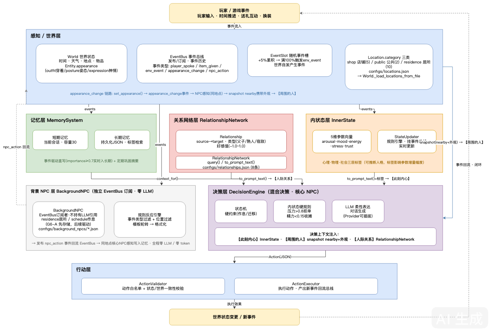

---
AIGC:
  ContentProducer: '001191110102MAD55U9H0F10002'
  ContentPropagator: '001191110102MAD55U9H0F10002'
  Label: '1'
  ProduceID: '20791bc5-03aa-4565-9398-cf17a99a56b5'
  PropagateID: '20791bc5-03aa-4565-9398-cf17a99a56b5'
  ReservedCode1: '869de5de-8c60-4078-8e15-2acd3c1f681e'
  ReservedCode2: '869de5de-8c60-4078-8e15-2acd3c1f681e'
---

# autonomous-npc-agent

一个**可配置、可复用的游戏 AI NPC 引擎**：让游戏中的 NPC 拥有感知、分层记忆、目标约束下的自主行为与对话能力，而不是只会机械回复的聊天挂件。

> 核心理念：**状态机管硬规则，LLM 管柔性表达** —— 用确定性约束防止大模型破坏游戏世界规则，用大模型赋予 NPC 自然的语言与个性化反应。

## 特性

- **分层架构**：感知/世界层 → 记忆层 → 决策层 → 行动层，职责单一、可独立替换
- **可插拔 LLM**：抽象 Provider 接口，兼容任意 OpenAI 协议端点；无 API Key 时自动降级到内置 Mock（离线可开发、可测试）
- **配置驱动人格**：NPC 人格、说话风格、作息日程全部由 JSON 配置定义，支持热加载，新增 NPC 零代码
- **分层记忆**：短期记忆（当前会话）+ 长期记忆（持久化 JSON），带基于标签/关键词/重要度/时间衰减的检索评分
- **记忆巩固**：短期记忆溢出时自动压缩沉淀为长期记忆（"记得你上次来过"的能力基础）
- **事件驱动记忆**：送礼等高价值事件（重要度 ≥ 0.7）实时直写长期记忆，无需等待有损巩固；提供 `player_gives` 送礼入口，NPC 会永远记得你给过他什么
- **量化内状态**：每个 NPC 拥有 8D 正交心智基底（4D 生理稳态：疲劳/饥饿/痛感/驱力 + 3D PAD 心境：愉悦/唤醒/支配 + 1D 压力负荷），事件驱动规则引擎实时更新——送礼涨好感（亲缘度写入关系网）、催单涨压力、干活累疲劳、睡觉回血
- **可推断标签系统**：人格配置支持心理学标签（如"较为自负 0.7""守财 0.8"），标签可推断地影响言行——被夸时唤醒涨幅高于常人、收到礼物时好感涨幅更大
- **先天属性创生器（T2 标签库首批）**：`engine/tag_genesis.py` 按"普通人占 70%"的世界观生成 NPC 先天底子——6D 正态属性（美貌/体魄/悟性/胆识/道德/酒量，N(5.0,1.25²) 截断于 [1,10]）+ 对数正态财富（90% 人口 10~50 铜板长尾）+ 特质金字塔（70/20/8/2）+ 齐普夫职业分布（s=1.15）+ 尧氏 8 风格×4 阶执念（萌芽 70%→病态 2%）；属性可折算离散中文称号（美貌六档：倾国倾城→面目可怖），为 <35 token 极简 prompt 组装供给标签；分布断言+规范契约锁全部可测
- **标签挂载层（T2 第二批）**：`engine/tag_mount.py` 每 NPC 一本标签账（`TagLedger`）——非背景 NPC 强制挂载 ≥1 显性缺陷（断指/跛足/烟瘾/贪杯/恐鼠/吝啬/洁癖，金字塔 uncommon 起步）+ ≥1 绝密把柄（杀人/私铸/私生/勾结/亏空，rare 起步），档位权重全部 import 引用 tag_genesis 金字塔（挂载层零分布逻辑，T4 复用零改动）；四时态分桶（先天/后天/瞬态 TTL/关系羁绊）+ 互斥锁自动消除（吝啬⇔慷慨、圣人⇔凶手、倾城⇔可怖）；显性标签注入决策上下文"身份标签："行（玩家可感知），绝密把柄永不进 prompt（T6 勒索玩法埋点）；挂载常驻化：configs 声明 `tag_profile: "genesis"` 的核心 NPC（chen/lily）引擎初始化即自动挂载（"断指的铁匠陈"是默认状态，玩家开箱可感知），`mount_tags` 显式 API 保留兼容，未声明 tag_profile 的 NPC 零挂载
- **脾气掩码双分区表（T2 前置条件层）**：`engine/temperament_table.py` 林传鼎 8 大显性脾气（安静/喜悦/暴躁/哀戚/惊恐/恭顺/傲慢/惭辱）× PAD 双值域分区触发条件——[0,1] 现实现版与 [-1,1] 规范版两套表并行、仿射映射锁语义等价、一处常量切换即接线（PAD 值域主人裁定后，掩码实施从"从头设计"降为"选表接线"）
- **内状态硬约束**：压力负荷过高自动拒绝接单、疲劳过高提前收摊，NPC 的内心状态直接决定行为边界，而非仅靠 LLM 自由发挥
- **世界活性（随机事件槽）**：世界维护事件槽，每次交互/时间推进累积 +5%，满 100% 自发触发环境事件（"铁匠陈想起该去收矿石了""莉莉盘算新货报价"），同地点 NPC 感知并写入记忆——世界不因玩家离线而静止
- **分层 NPC（轻量背景 NPC）**：核心 NPC 跑完整决策链（人格+记忆+LLM），背景 NPC 只用"身份+一句概括+关系"纯规则反应——零 LLM 调用、零记忆开销，让村庄有人气但不烧 token
- **关系网络**：NPC 之间结构化存储社会关系（父子/熟人/宿敌，好感/敌意值），关系数据注入核心 NPC 决策上下文——提到其父时语气变化、提及熟人时态度不同
- **外观与环境状态**：实体拥有可变外观（穿着/姿势），换装作为 `appearance_change` 事件发布，同地点 NPC 感知写入记忆、异地无感知；决策上下文注入【周围的人】块——NPC 对话能"看见"并引用对方穿着（"你今天穿着围裙"）
- **垫话引擎**：慢脑 LLM 调用前**同步返回反应性垫话占位**（`player_says` 结果含 `filler` 字段）——脾气掩码（chen 暴躁/lily 喜悦等 3 掩码先行）× 8D 当下状态双驱动：铁匠陈压力过载时垫话带烦躁语气（"（皱眉）找老夫何事？"）、心情好时是常态反应，同一 NPC 不同状态下开场白可感知分叉；0-token 本地计算不进 LLM prompt，T2 落地 8 脾气掩码后替换标准掩码表
- **小村庄世界**：地点按"店铺/公共空间/居所"三类组织为可探索结构（`configs/locations.json` 配置化，内置默认 17 地点），NPC 扩至 10 个且全部配置化（各有居所/作息/职业/社会关系），作息表驱动 NPC 在居所与工作地间按时间移动（核心+背景 NPC 均参与）；新增以背景 NPC 为主（零 LLM），核心 NPC 仍跑完整决策链——村庄有人气但不增 token 成本
- **Token 经济性度量与主动削减**：LLM Provider 上报每次调用的 token 用量（`last_usage`：prompt/completion/total_tokens），`NPCEngine` 按 NPC 聚合统计（`token_stats`），`status()` 暴露 token 报告字段——背景 NPC 零 LLM 以 token 数（非调用次数）可断言、可度量、可对比趋势；**上下文裁剪**：决策上下文注入的近期记忆从 6 条裁剪至 4 条（`RECENT_CONTEXT_WINDOW=4`），直接削减 prompt token，token 趋势：上下文裁剪下降 4435→4660→4553，T1 8D 基底重构后 4737（8 参数 prompt 增长，T3 快慢脑将大幅削减），seed=42 确定性可复现
- **可靠性护栏**：动作白名单 + 状态机校验 + 内状态硬约束，LLM 输出经过验证器过滤，异常时安全回退
- **零依赖内核**：engine 核心仅使用 Python 标准库；FastAPI 服务为可选层
- **可视化 Demo**：自带 2D 俯视小地图 + 聊天界面的 Web 演示端

## 快速开始

### 1. CLI 演示（零依赖，开箱即跑）

```bash
python3 scripts/run_demo.py
```

进入 REPL 后：

```
> look                      # 查看世界状态
> talk chen 你好，能帮我打一把剑吗？   # 和铁匠陈对话
> talk lily 今天有什么新货？           # 和商人莉莉对话
> tick                      # 推进世界时间
> quit
```

默认使用 Mock LLM（规则回退），**无需任何 API Key**。

### 2. 接入真实大模型

```bash
export NPC_LLM_BASE_URL="https://api.example.com/v1"   # 任意 OpenAI 兼容端点
export NPC_LLM_API_KEY="sk-..."
export NPC_LLM_MODEL="your-model"

python3 scripts/run_demo.py --llm openai
```

也可以复制 `.env.example` 为 `.env` 填入真实值（`.env` 已被 gitignore，不会提交）。
接入后可用冒烟测试验证全链路：

```bash
python3 scripts/llm_smoke.py    # 真实模型跑 感知→记忆→决策→行动 闭环
```

### 3. Web 可视化演示

```bash
pip install -r requirements.txt   # 仅 fastapi + uvicorn
python3 -m api.server             # 打开 http://127.0.0.1:8000
```

### 4. Docker

```bash
docker build -t autonomous-npc-agent .
docker run -p 8000:8000 autonomous-npc-agent
```

## 项目结构

```
autonomous-npc-agent/
├── engine/                # 核心引擎（纯标准库）
│   ├── world.py           # 感知/世界层：世界状态、事件总线
│   ├── memory.py          # 记忆层：短期/长期记忆、巩固、检索
│   ├── decision.py        # 决策层：状态机约束 + LLM 混合决策
│   ├── actions.py         # 行动层：动作定义、白名单校验、执行器
│   ├── inner_state.py     # 内状态层：量化心理参数 + 事件驱动规则引擎
│   ├── relationships.py   # 关系网络：NPC 社会关系存储与查询
│   ├── background_npc.py  # 背景 NPC：轻量级零 LLM 规则反应
│   ├── npc.py             # NPC 装配：人格配置、感知订阅、内状态
│   ├── engine.py          # 引擎入口：世界与 NPC 的编排
│   └── llm/               # 可插拔 LLM Provider
│       ├── base.py        #   抽象接口
│       ├── openai_compat.py  # OpenAI 协议实现
│       └── mock.py        # 离线 Mock（开发/测试用）
├── configs/npcs/          # 核心 NPC 人格配置（JSON，热加载）
├── configs/background_npcs/  # 背景 NPC 配置（JSON）
├── configs/relationships.json  # NPC 关系网络配置
├── configs/locations.json     # 村庄地点配置（三类可探索结构）
├── api/server.py          # FastAPI 服务（可选）
├── demo/index.html        # 2D 可视化演示端
├── scripts/run_demo.py    # CLI REPL 演示
├── tests/                 # 单元测试 + 引擎集成测试
├── ARCHITECTURE.md        # 架构设计文档
└── Dockerfile
```

## 架构一图流



- 事件经 EventBus 分发，**记忆层**（短期/长期/事件驱动直写）、**内状态层**（8D 正交心智基底 + 规则引擎 + 荀子六情映射 + 标签）、**关系网络层**（好感值 → 【人际关系】注入）并行消费
- **背景 NPC 层**独立于决策层：EventBus 订阅 → 规则反应 → npc_action 事件回流，全程零 LLM 调用
- 决策层混合决策：状态机与内状态管**硬规则**，LLM 管**柔性表达**；上下文注入【此刻内心】【周围的人】(nearby+外观)【人际关系】三块
- **外观链路**：set_appearance → appearance_change 事件 → NPC 感知 → snapshot nearby 携带外观 → 决策上下文
- **村庄结构**：Location.category 三类（shop 店铺 / public 公共 / residence 居所），configs/locations.json 配置化加载
- 行动层白名单校验后执行，新事件回流总线，形成**世界闭环**

图表源文件 [docs/architecture.drawio](./docs/architecture.drawio) 可在 [app.diagrams.net](https://app.diagrams.net) 打开编辑。详见 [ARCHITECTURE.md](./ARCHITECTURE.md)。

## 测试

```bash
python3 -m unittest discover -s tests -v
```

覆盖：记忆读写与巩固、事件驱动长期写入、玩家送礼闭环、事件总线、状态机迁移约束、动作白名单校验、LLM 异常输出回退、引擎端到端闭环、量化内状态参数变化、标签行为影响、内状态硬约束（压力/疲劳阈值拒绝）、疲劳随时间变化与恢复、随机事件槽累积与触发、环境事件 NPC 感知与确定性测试、背景 NPC 规则反应与零 LLM 调用断言、关系网络 CRUD 与决策上下文注入、外观状态更新与事件发布契约、NPC 感知位置过滤（同地可见/异地不可见）、对话上下文的外观引用与 token 经济性（空 nearby 不注入）、村庄规模与运转（NPC≥10/地点≥15 三类齐全/全员居所注册/背景 NPC 零 LLM/全村庄 tick 推进/status 全村庄覆盖）、作息驱动位置移动（SLEEPING 移居所/WORKING 移工作地/IDLE 保持原位/核心+背景 NPC 均参与/全天运转后 token 基线对比）、Token 度量基线（Mock 字符数估算/OpenAI usage 解析/背景 NPC 零 token 断言/status token_stats 字段）、Mock 话题匹配范围修复（仅扫描【玩家说】段，地点名与外观文本不误触发）、环境事件池覆盖全部 10 NPC（16 条自发事件 + 对抗性池-常量锁 + 背景NPC事件感知回流）、上下文裁剪对抗性测试（RECENT_CONTEXT_WINDOW=4 常量锁 + 最多4条断言 + 最新4条顺序验证）、Token 基线确定性测试（random.seed(42) 固定天气随机 + 多次运行结果一致 + PINNED_TOTAL_TOKENS=4737 口径锁）、先天属性创生分布断言（6D 正态均值/σ/值域、财富对数正态中位数与长尾、金字塔 70/20/8/2、尧氏 32 组合全覆盖、齐普夫频率-理论一致、规范契约锁：参数硬编码比对+零第三方依赖）。

## 路线图

- [x] **L1** 单 NPC 对话 + 人格配置 + 世界感知 + 分层记忆
- [x] **L2** 事件驱动的记忆写入（高价值事件实时直写长期记忆 + 玩家送礼入口，2026-09-28）
- [x] **内状态** InnerState 参数向量 + 规则引擎状态更新器 + 可推断标签系统 + 内状态硬约束（2026-09-28）
- [x] **世界活性** 随机事件槽 + 环境事件自发触发 + NPC 感知写入记忆（2026-09-29）
- [ ] **L2+** 对玩家的长期记忆强化（"你上周帮过我"）、语义化检索、记忆巩固升级（LLM 摘要）
- [ ] **L3** 目标驱动的自主行为（日程、需求、主动性）
- [x] **L4 前置** 轻量背景 NPC（零 LLM 规则反应）+ 关系网络（结构化存储+注入决策上下文）（2026-09-30）
- [x] **外观与环境状态** Entity 可变外观 + appearance_change 事件 + 感知位置过滤 + 【周围的人】决策上下文注入（2026-10-01）
- [ ] **村庄里程碑 G6** 地点村庄化（三类可探索结构）+ NPC 扩至 10+ 全配置化 + 全村庄运转验证（G6-A 地点与 NPC 配置完成 2026-10-02，G6-B 作息驱动运转验证完成 2026-10-03）
- [x] **T1 心智 v2** 8D 正交心智基底（4D 生理稳态 + 3D PAD 心境 + 1D 压力）+ 荀子六情事件→PAD 矢量映射器 + trust 迁移关系网（主体 2026-10-06；收尾 2026-10-07：六情矢量方向归正跟随规范+矢量-规范契约锁测试）
- [ ] **T2 标签库 v2** 6D 先天正态属性 + 林传鼎 8 显性脾气掩码 + 尧氏 8 风格×4 阶执念 + 缺陷/把柄强制挂载 + 金字塔长尾分布（首批已落地 2026-10-07：`engine/tag_genesis.py` 生成器+分布断言+规范契约锁 32 用例；第二批已落地 2026-10-08：`engine/tag_mount.py` 缺陷+把柄强制挂载+四时态+互斥锁 32 用例 + `engine/temperament_table.py` 8 脾气双值域分区表 33 用例；收口先行批已落地 2026-10-09：chen/lily 挂载常驻化（configs 声明 `tag_profile: "genesis"` + `spawn` 自动挂载 + token 基线 4737→4769 合法增量，`tests/test_tag_residency.py` 15 用例）；余项：PAD 裁定后 8 掩码接线 filler、chen/lily 重配）
- [ ] **T3 快慢脑** 意图规则 0-token 秒回 + 脾气掩码垫话引擎 + <35 token 极简 Prompt 组装（垫话引擎原型已先行落地 2026-10-06：3 脾气掩码×8D 状态双驱动，`filler` 字段接入 `player_says`，真实 LLM 冒烟通过）
- [ ] **T4 人口学村庄** 25 NPC 按正态属性 + 齐普夫职业分布生成，关键 NPC 与环境 NPC 双轨分流
- [ ] **T5 行为经济学** 杜希格习惯回路 0-token 截断 + EWMA 财富基准 + 禀赋效应
- [ ] **T6 把柄玩法** 把柄勒索博弈 + 醉酒结算 + 瞬态标签生命周期
- [ ] **L4** 多智能体社会（NPC 互聊、关系网深化、信息传播）
- [ ] 行为评测集（给定场景断言 NPC 行为合理性，自动化回归）（首批 2 指标已落地 2026-10-07：`scripts/dialogue_quality.py` 记忆引用率+状态影响可见性，Mock 基线 100%/100%；`--provider real` 真实 LLM 对照 2026-10-08 落地：J2 回复层 1/6→2/6 刺破 Mock 话术库巧合命中、C1 动作分叉 4/6→6/6 非硬约束对真实分叉；场景集扩充并入 T3）

> v2 世界模型蓝图的完整定义见 [ARCHITECTURE.md](./ARCHITECTURE.md) 的 v2 章节与 docs/ 三份规范（世界规范 / 工程实施 / 标签数据库）。

## License

MIT

> AI生成