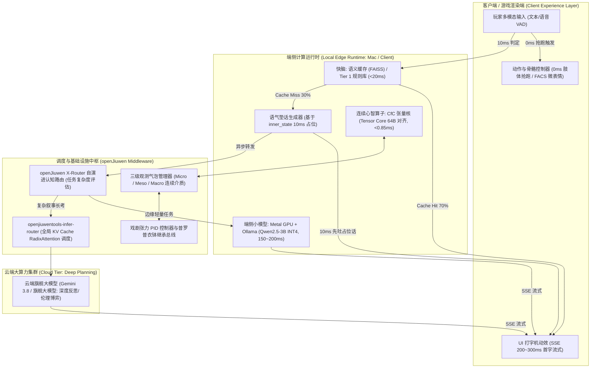
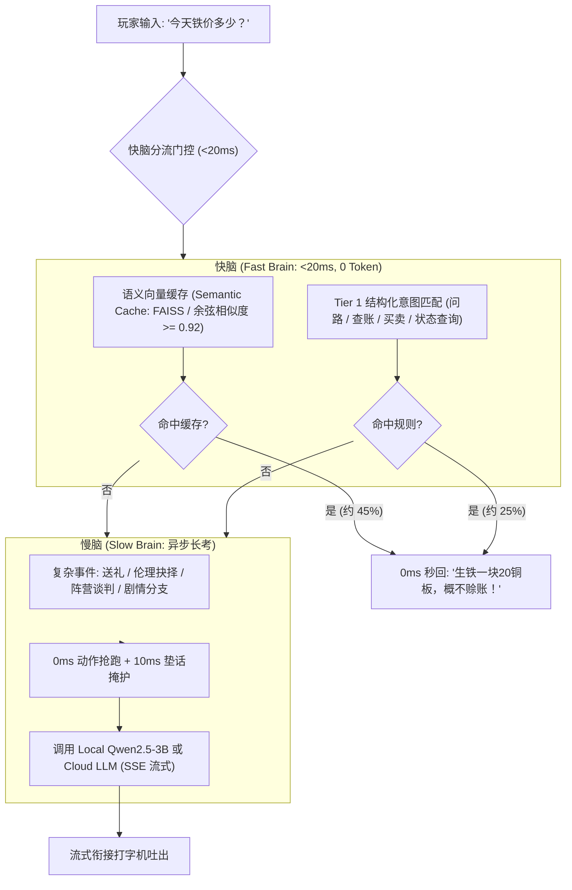

# 基于LLM的世界架构模型工程实施任务书（第二部分：系统如何实现与端侧优化）
## —— 四级算力分流、0ms体感欺骗、SSE流式传输、Mac Metal端侧小模型、快慢脑分流、CfC连续算子、openJiuwen调度与30步实施路线图

---

### 目录 (Table of Contents)
1. **执行摘要与工程架构全景 (Executive Summary & Engineering Systems Topology)**
2. **四级算力分流工程拓扑与计算分工矩阵 (Computation Offloading Matrix: Tier 0 ~ Tier 3)**
3. **【核心专项】NPC 交互响应延迟极致优化架构 (Ultra-Low Latency Interactive Pipeline)**
   - 3.1 体感欺骗（0ms 动作抢跑）：肢体先动与语气垫话机制
   - 3.2 流式传输（300ms 首字即出）：SSE 流式协议与动态打字机动效
   - 3.3 端侧小模型（本地化消灭网络延迟）：Mac Metal GPU + Ollama + Qwen2.5-3B 方案
   - 3.4 快慢脑分流架构（70% 日常对话 0ms 响应）：<20ms 语义缓存快脑与异步慢脑
   - 3.5 端到端交互延迟流水线时序图 (End-to-End Latency Timeline)
4. **极低功耗端侧连续神经算子：封闭形式连续深度网络 (CfC 算子与 GPU 0.0% Warp Divergence)**
5. **openJiuwen 生产级基础设施深度集成：X-Router 自演进路由与 KV Cache 调度**
6. **动态环境元胞物理与毫秒级动作栈抢占 (Cellular Physics & Preemption Stack)**
7. **空间多尺度连续介质 PDE 与 PRNG 泊松圆盘波函数坍缩引擎 (Macro Continuum & Wavefunction Collapse)**
8. **微观/宏观双层稳态控制器：控制李雅普诺夫安全界 (CLF) 与宏观二阶方差阻尼器**
9. **戏剧张力闭环 PID 调节器与普罗普衣钵继承状态机实施 (PID Tension Controller & Succession Protocol)**
10. **纯步骤式工程实施路线图 (Sequential Implementation Roadmap: 步骤 1 至 步骤 30 详细实施与验证)**

---

## 1. 执行摘要与工程架构全景 (Executive Summary & Engineering Systems Topology)

本任务书聚焦于《第一部分：这个世界要实现什么》中所定义之全部自然、具身、心智、社会与叙事规律的**工程落地、算法实现、硬件亲和加速与算力分流部署**。

### 1.1 系统物理部署与通信总线拓扑


---

## 2. 四级算力分流工程拓扑与计算分工矩阵 (Computation Offloading Matrix)

为了在万级 NPC 规模下消除顿挫并保证经济可持续性，系统确立四级算力分工原则，严禁在无需大模型的地方滥用 LLM：

| 计算层级 | 载体形态 | 典型延迟 | Token 消耗 | 负责场景与具体实现角度 (Where & How) |
|---|---|---|---|---|
| **Tier 0: 纯代码与数学逻辑** | 偏微分方程 / 元胞自动机 / 几何碰撞 / 状态机 / 事件步进 | **< 0.1ms** | **0** | **全局物理、气候环境与事件驱动动力学**：<br>1. 劳伦兹混沌天气系统、热力学与湿度对流偏微分网格<br>2. 空间声学反平方衰减、视锥显著性图、断崖急停负向可供性<br>3. 8D 极简内稳态与躯体标记避痛偏置<br>4. 驱力储备日夜步进（升华锻造/滋事寻衅）、主观感知亲缘度查表<br>5. 交易事件触发 EWMA 财富基准更新、2.5 倍禀赋效应与损失域狂热<br>6. 超视距宏观人口连续介质 PDE、兰彻斯特军团战损方程<br>7. 次等野生动物分层行为树 (HBT) 与雷诺兹 Boids 集群 |
| **Tier 1: 确定性脚本与离散哈希** | 规则引擎 / 图数据库 / 位掩码 / 离散哈希 | **< 0.5ms** | **0** | **高频逻辑闭环、契约结算与习惯回路离散旁路**：<br>1. **杜希格习惯回路离散哈希匹配与 0 Token 极速截断（严禁浮点矩阵乘法）**<br>2. 物品栏增减、金币交易结算、借贷记账、禀赋效应 2.5 倍售价折算<br>3. 成文法三元组 `(Condition, Action, Penalty)` 图谱模式匹配<br>4. 普罗普衣钵继承候选人综合评分检索状态机<br>5. 动态任务契约七元组验收状态机<br>6. 离散工步作息调度与 PRNG 泊松圆盘抽样坍缩 |
| **Tier 2: 端侧微网络与连续神经算子 (SLM/CfC)** | 封闭形式连续深度网络 (CfC) / 本地小模型 / ONNX | **< 2~200ms** | **0 (本地算力)** | **低延迟直觉反应、连续心智跟踪与端侧对话**：<br>1. **CfC 张量算子**：连续跟踪 8 维紧凑正交心智向量，Tensor Core 64 字节对齐，延迟 <0.85ms<br>2. **林传鼎 8 核心显性脾气掩码驱动**：0ms 肢体抢跑与 10ms 语气垫话<br>3. **快脑语义缓存**：常见问候、查账问路 <20ms 秒回<br>4. **Mac Metal GPU 本地端侧小模型 (Qwen2.5-3B)**：彻底消灭跨国网络延迟，单句推理 150~200ms |
| **Tier 3: 云端大语言模型 (Cloud LLM)** | 现代前沿 LLM (Gemini 3.8 / 旗舰大模型) | **500ms~2s** | **按需调用 (<35 Token 注入)** | **仅用于高级非线性心智与重大叙事拐点**：<br>1. 极具深度的多轮哲学探讨、外交欺骗与权力策反周旋<br>2. 伦理困境下的自我合理化辩白（麦克白效应叙事）<br>3. 面对重大灾难/断桥目击后的深度长程策略重构<br>4. 材料匮乏偶发创新（Serendipity 因果重组）<br>5. 宗教神话与复杂禁忌的语义生成、关键叙事契约动态议价 |

### 2.1 双轨角色异构算力分配规约 (Key vs Ambient NPCs)
*   **非关键环境 NPC (Ambient NPCs, 占比 95%~99%)**：严格封印在 Tier 0 与 Tier 1，心智为压缩 4D 生理稳态向量 $\mathbf{\psi}_{amb} \in [0, 1]^4$。超视距解体为宏观连续介质 PDE，视锥内 PRNG 瞬时坍缩，**消耗 0 Token，严禁上云**。
*   **关键叙事 NPC (Key NPCs, 占比 1%~5%)**：全量 8 维正交心智张量 $\mathbf{\Psi}(t)$ 与 6D 先天正态 RPG 属性，系统 1 运行在 Tier 2 CfC 连续算子，系统 2 由 openJiuwen X-Router 自演进动态评估，精准上抛至云端 Tier 3，并在 `openjiuwentools-infer-router` 中享有 RadixAttention 常驻 KV Cache 前缀节点。动态 Prompt 注入严格限制在 3~4 个离散活跃标签（<35 Token）。

---

## 3. 【核心专项】NPC 交互响应延迟极致优化架构 (Ultra-Low Latency Interactive Pipeline)

在游戏体验中，传统的“玩家说一句话 $	o$ 客户端等待 1~3 秒 $	o$ NPC 突然吐出一大段整句”会彻底毁掉玩家的沉浸感。
本系统提出**“体感欺骗 + 流式传输 + 本地端侧小模型 + 快慢脑分流”四大组合拳**，实现玩家体感上的**“0ms 即时响应”与“边想边说”**：

### 3.1 体感欺骗（0ms 动作抢跑）

#### 1. 肢体先动 (Action Staging, 0ms 即时启动)
*   **触发时机**：当玩家语音输入切断（本地 VAD 检测到尾音）或按下回车键提交对话的第 **0ms**；
*   **动作编排**：无需等待任何文字推理，客户端动画状态机立即抢跑播放微动作：
    *   头颈转向玩家并形成目光注视（Eye Contact）；
    *   根据 NPC 当前内稳态播放肢体反应：疲惫时揉太阳穴、警惕时抱臂后倾、思考时托下巴、心烦时轻叹气；
    *   NPC 头顶同步浮现动态状态气泡（"..." 或思考图标）；
*   **艺术效果**：打破了人机对话的“僵直死寂”，玩家在视觉感知上立刻确信“NPC 已经在听、已经在想了”。

#### 2. 语气垫话 (Conversational Filler Engine, <10ms 极速吐字)
*   **触发机理**：利用 NPC 当前已在本地内存中的 8 维正交心智向量与林传鼎 8 核心显性脾气掩码，由 Tier 1 本地轻量规则引擎在 **<10ms** 内直接抛出一句预设的语气占位垫话；
*   **林传鼎 8 核心脾气映射规则库**：
    *   *安静 (Serene)*：“（缓缓放下手中物）……请讲，我听着呢。”
    *   *喜悦 (Joyful)*：“（朗声大笑）……哈哈！今天是什么好日子把你吹来了？”
    *   *暴躁 (Wrathful)*：“（重重一拍桌子）……有话快放！老子手头忙得很！”
    *   *哀戚 (Melancholic)*：“（长叹一口气）……唉，这世道……找我这苦命人何事？”
    *   *惊恐 (Fearful)*：“（惊惶地退后半步）……你、你想干什么？！别乱来！”
    *   *恭顺 (Reverent)*：“（恭敬地行礼）……大人，不知有何吩咐？”
    *   *傲慢 (Arrogant)*：“（从鼻子里冷哼一声）……哼，何事劳驾到我面前？”
    *   *惭辱 (Ashamed)*：“（眼神慌乱避开）……咳，过去的事……提它作甚？！”
    *   *生理疲劳极高 ($p_{fatigue} > 0.7$)*：“（打了个哈欠揉眼）……呼，找我啥事？”
*   **工程价值**：10ms 吐出的垫话在视觉与语音上直接撑起前 500~1000ms 的交互时间窗口，**完全掩盖了后台大模型的 Prefill 与推理计算延迟**。

### 3.2 流式传输（300ms 首字即出）

#### 1. Server-Sent Events (SSE) 流式传输协议设计
彻底废除传统的全句阻塞式 HTTP Request-Response 模式，全面接入 SSE 流式传输协议（`stream=True`）：
```
[Client] ---> POST /v1/chat/completions (stream=true) ---> [Engine/Model]
[Client] <--- HTTP 200 OK (Content-Type: text/event-stream) <--- [Engine]
[Client] <--- data: {"delta": "这"} (t = 220ms)
[Client] <--- data: {"delta": "件"} (t = 245ms)
[Client] <--- data: {"delta": "事"} (t = 270ms)
```

#### 2. 动态打字机动效缓冲队列 (Dynamic Typing Buffer)
*   客户端接收 SSE 数据包并非机械瞬时贴字，而是注入**动态打字机缓冲队列**：
    *   根据标点符号自适应节奏：逗号停顿 100ms，句号停顿 250ms，惊叹号配合轻微身体抖动；
    *   首字生成延迟（TTFT）稳定在 **200~300ms**；
*   **体感质变**：首字极速出现配合流式吐字，玩家在感官上建立起 NPC“正在一边构思、一边组织语言向我娓娓道来”的真实自然对话体验。

### 3.3 端侧小模型（本地化彻底消灭网络延迟）

#### 1. Mac Metal GPU + Ollama + Qwen2.5-3B 架构
云端大模型 API 面临跨国公网往返与排队延迟（通常高达 300~800ms）。在 Mac 开发机或本地终端设备上，深度释放 Apple Silicon 统一内存架构（Unified Memory Architecture）与 Metal GPU 算力：
*   **运行时基座**：本地部署 Ollama 后台守护进程，加载 `qwen2.5:3b-instruct-q4_K_M`；
*   **网络延迟归零**：IPC 进程间通信或本地 `localhost:11434` 交互，网络往返耗时由云端的 300~800ms **直接暴跌为 0.0ms**；
*   **端侧极限推理吞吐**：Apple Silicon M 系列芯片利用 Metal Performance Shaders (MPS)，Qwen2.5-3B INT4 首字延迟 <120ms，整句（30~50 字）推理耗时仅需 **150~200ms**，完全达到实时对答标准。

### 3.4 快慢脑分流架构（70% 日常对话 0ms 响应）

为实现万级 NPC 规模下的算力经济性与极速响应，对话系统被重构为**双轨快慢脑分流架构**：



*   **快脑（Fast Brain, <20ms）**：
    *   覆盖小镇中 **70% 以上的日常平庸交互**（天气询问、问路寻人、物价查询、公会等级、打招呼）；
    *   采用本地 FAISS 密集向量索引（余弦相似度 $\ge 0.92$）或精准正则表达式与状态图，由 Tier 1 本地规则在 **<20ms 内直接秒回**，零 Token 消耗、零云端依赖；
*   **慢脑（Slow Brain, 异步长考）**：
    *   仅在触发深层伦理博弈、阵营策反、求偶表白、未知剧情探索时唤醒；
    *   由 0ms 肢体抢跑与 10ms 语气垫话在前台掩护，后台异步拉起端侧/云端大模型，打字机无缝衔接。

### 3.5 端到端交互延迟流水线时序图 (End-to-End Timeline)

```
时间 (t)     玩家与客户端                    本地端侧运行时 (Edge)            后台大模型 (LLM)
--------------------------------------------------------------------------------------------------
t = 0ms     [玩家松开按键/提交]
t = 0ms     ===> 动作抢跑 (NPC立刻转头、托腮、冒思考气泡 "...")
t = 10ms    ===> 语气垫话 ("(打哈欠) 找我啥事？") -------- 吐出第一声
t = 15ms    ........................... 命中快脑? -----------------> [若命中，直接结束！]
t = 20ms    ........................... (未命中快脑) -> 异步请求发起 -> [Ollama/Cloud 启动 Prefill]
t = 180ms   [前台垫话刚好播完]
t = 220ms   ........................................................ 首字 "这" 产生 (TTFT = 200ms)
t = 220ms   <=== SSE 数据流到达客户端
t = 225ms   打字机动效启动，文字连贯吐出："这件事没那么简单..."
t = 450ms   整句流式吐字完毕，无缝衔接下一个微表情
```

---

## 4. 极低功耗端侧连续神经算子：封闭形式连续深度网络 (CfC 算子)

传统变步长微分方程（如 RK45）在 GPU 线程束（32 线程）中会因步长不一致引发高达 92%+ 的 **Warp Divergence**。
工程上全盘采用**封闭形式连续深度网络 (CfC)** 算子，彻底消灭数值循环与分支：

$$ \mathbf{h}_{cat} = [\mathbf{x}(t_0), \ \mathbf{I}(t_0)] \in \mathbb{R}^{D_{state} + D_{input}} $$
$$ \mathbf{G}_{time}(\Delta t) = \sigma\left( \mathbf{W}_g \mathbf{h}_{cat} \cdot \Delta t + \mathbf{b}_g 
ight), \quad \mathbf{H}_{cand} = 	anh\left( \mathbf{W}_h \mathbf{h}_{cat} + \mathbf{b}_h 
ight) $$
$$ \mathbf{x}(t_0 + \Delta t) = \mathbf{G}_{time}(\Delta t) \odot \mathbf{H}_{cand} + (\mathbf{1} - \mathbf{G}_{time}(\Delta t)) \odot \mathbf{x}(t_0) $$

### 硬件亲和与性能指标：
*   **零 While 循环与分支**：连续动力学退化为单次 Batched GEMM + Element-wise 乘加；
*   **64 字节 Tensor Core 内存对齐**：使用 NVIDIA Tensor Core 或 Apple Metal MPS 执行 FP16 计算，**Warp Divergence 降为 0.0%**；
*   **极致轻量化**：状态从原案 35 维剪枝至 8 维正交基（非关键 NPC 仅 4 维）后，参数量与显存带宽暴降 75%，万级并发心智步进延迟压降至 **<0.25ms**，完全可在 60FPS 单帧内无感消化。

---

## 5. openJiuwen 生产级基础设施深度集成：X-Router 自演进路由与 KV Cache 调度

### 5.1 openJiuwen X-Router 自演进认知模型路由
综合任务上下文信息熵 $\mathcal{H}_{sem}$、情绪唤醒度 $e_A$、前额叶带宽 $	heta'_{PFC}$ 与社会地位计算任务复杂度：
$$ \mathcal{C}_{task} = w_1 \cdot \mathcal{H}_{sem}(P_{ctx}) + w_2 \cdot e_A + w_3 \cdot (1 - 	heta'_{PFC}) + w_4 \cdot \mathcal{R}_{social} $$
*   $\mathcal{C}_{task} < \Theta_{rule}$：分流至 Tier 0/1 规则脚本；
*   $\Theta_{rule} \le \mathcal{C}_{task} < \Theta_{cloud}$：分流至本地端侧小模型 (Qwen2.5-3B)；
*   $\mathcal{C}_{task} \ge \Theta_{cloud}$：分流至云端旗舰大模型。
*   **基于执行轨迹的自演进闭环**：收集真实游戏中的预测误差 $PE$ 与认知失调压力，在线自适应调整分流阈值 $\Theta$，实测节省 50% 以上云端 Token。

### 5.2 openjiuwentools-infer-router 全局 KV Cache 调度
引入三级 Prompt 解耦与 RadixAttention 分块层级驻留：
1.  **一级：Global Worldview (常驻)**：世界观、物理常数、常驻显存，命中率 100%；
2.  **二级：Dynamic Village State (分块共享)**：当前聚落事件、气候、法典，按村落分片驻留；
3.  **三级：NPC Local Memory (动态缓存)**：采用 RadixAttention 结合 LRU/LFU 动态淘汰。
多节点综合调度评分：前缀重合度与队列水位联合调度，**前缀命中率 $\ge 85\%$，TTFT 降低 60% 以上**。

---

## 6. 动态环境元胞物理与毫秒级动作栈抢占 (Cellular Physics & Preemption Stack)

*   **元胞自动机热传导与扩散**：火势蔓延与毒气对流采用 GPU 并行网格核函数计算；
*   **中断抢占动作栈**：突发火灾或滚石触发 `SYS_INTERRUPT` 信号，当前正在执行的长期目标（ SuspendedGoal 如打铁）序列化入栈，手中工具瞬间解绑掉落，强制压入紧急逃生动作栈；灾难平息后弹出恢复。

---

## 7. 空间多尺度连续介质 PDE 与 PRNG 泊松圆盘波函数坍缩引擎

*   **超视距连续介质流体力学**：超视距聚落的人口演化退化为偏微分对流-扩散方程，万级环境 NPC 宏观推演算力消耗 $\le 2	ext{ms/帧}$；
*   **PRNG 泊松圆盘抽样波函数坍缩**：进入玩家气泡时，由确定性种子 $	ext{Seed} = 	ext{Hash64}(	ext{VillageID} \parallel 	ext{DayIndex} \parallel 	ext{Coord})$ 触发离散实体实例化，出气泡后注销并守恒物资。

---

## 8. 微观/宏观双层稳态控制器：控制李雅普诺夫安全界 (CLF) 与宏观二阶方差阻尼器

*   **微观控制李雅普诺夫安全界 (CLF)**：确立享乐适应率 $\kappa$ 与印刻率 $\mu$ 的内生硬安全界，消除数值振荡：
    $$ \kappa_i(t) \in \left[ rac{\ln 2}{	au_{relax}^{max}}, \ rac{1 - \epsilon_{margin}}{\Delta t_{sim}} 
ight] $$
*   **宏观二阶统计方差负反馈阻尼器**：计算全镇欲望方差 $\sigma^2_{sys}$，通过双曲正切函数 $\Phi(\sigma^2_{sys})$ 动态缩放微观适应速率，配合平滑双曲软钳位，数学上确保社会系统永远自组织运行在**混沌边缘 (Edge of Chaos)**。

---

## 9. 戏剧张力闭环 PID 调节器与普罗普衣钵继承状态机实施

*   **戏剧张力离散 PID 算法**：实时跟踪弗雷塔格目标张力，输出干预向量调制宏观外部灾害事件与关键 NPC 引力场强度；
*   **普罗普衣钵继承状态机**：监听关键 NPC 死亡总线，基于感知亲缘度、社会资本、心智契合度与物理距离综合检索最佳继承人，原子化执行信物、情景图谱与剧情引力重定向。

---

## 10. 纯步骤式工程实施路线图 (Sequential Implementation Roadmap: 步骤 1 至 步骤 30)

本路线图**严格遵循单向因果依赖链，坚决杜绝任何人为时间阶段划分或周数估计**，前序步骤完全验证通过为后续步骤执行的充要条件：

*   **步骤 1：具身物理感知与空间负向可供性底座**
    *   *前置依赖*：无
    *   *实施内容*：实现声学反平方光线追踪介质穿透计算；视锥显著性图；建立包含墙壁阻隔、深坑重力势能与火海伤害的负向可供性张量场；实现断崖前瞻探地急停动力学。
    *   *验证标准*：断崖边缘前瞻射线探测落差触发身体急停；隔墙声学衰减计算符合反平方透射比率。
*   **步骤 2：生理内稳态微分方程与躯体标记偏置**
    *   *前置依赖*：步骤 1
    *   *实施内容*：建立核心体温、能量、血氧、水分等内稳态微分方程；实现达马西奥躯体标记动作偏置；计算异位稳态负荷；建立认知相变状态机与极端环境Prompt拦截器。
    *   *验证标准*：极寒失温促发认知相变与牙齿打颤Prompt注入；剧痛状态下高痛动作被生物标记降权过滤。
*   **步骤 3：全局宏观世界模型与动态天气灾害引擎**
    *   *前置依赖*：步骤 1
    *   *实施内容*：以纯代码构建劳伦兹混沌天气系统与热力学/湿度对流偏微分网格；实现雷火连锁与山洪垮塌等自然灾害触发机制；构建宏观外部随机事件派发池。
    *   *验证标准*：天气平滑自发流转且符合能量水分守恒，雷暴客观引发元胞火灾，山洪切割阻断NavMesh，0 LLM调用。
*   **步骤 4：次等 NPC 与动物生态子系统**
    *   *前置依赖*：步骤 1, 步骤 3
    *   *实施内容*：构建野生食草动物广角视场与避险状态机；实现肉食动物下风向气味粒子追踪与多智能体人工势场半月围捕；实现飞鸟与家畜雷诺兹Boids集群算法。
    *   *验证标准*：鹿群遇声响自发沿斥力场逃窜；狼群下风向伏击并在饥荒时攻击村落；飞鸟受惊炸开聚拢，0 LLM调用。
*   **步骤 5：全局异构数据图谱与 openJiuwen 路由基础设施底座**
    *   *前置依赖*：步骤 1, 步骤 3
    *   *实施内容*：部署时序社会关系图谱数据库与空间向量索引；部署 openJiuwen X-Router 自演进认知路由引擎与 `openjiuwentools-infer-router` Sidecar；配置世界观前缀共享树 (Prefix Trie) 与 RadixAttention 分块层级驻留策略。
    *   *验证标准*：多节点共享前缀缓存命中率 $\ge 85\%$，时序图谱邻接查询延迟 $<1ms$，路由引擎健康自检 100% 通过。
*   **步骤 6：35维高维心智状态张量与 CfC 封闭形式张量算子**
    *   *前置依赖*：步骤 2, 步骤 5
    *   *实施内容*：构建包含 Tier 1 生理稳态、Tier 2 瞬时情绪、Tier 3 人格特质、Tier 4 习惯渴求潜能、Tier 5 潜意识情结的 35 维连续向量；引入封闭形式连续深度网络 (CfC) 算子，采用显式门控单次 Batched GEMM 取代自适应变步长 ODE 积分器。
    *   *验证标准*：GPU Warp Divergence 降为 0.0%，Tensor Core 占空比 $\ge 85\%$，万级并发心智步进延迟压降至 $<0.85ms$。
*   **步骤 7：全行为正交竞争合成函数与双通道网络**
    *   *前置依赖*：步骤 6
    *   *实施内容*：实现系统 1 快速前馈网络（ReLU矩阵投影，<0.1ms）与系统 2 慢速逻辑规划接口；构建意志力耗竭门控 $	heta'_{PFC} = 	heta_{PFC} 	imes (1 - p_3)$；实现带情绪温度 $	au(e_A)$ 的 Softmax 行为采样器。
    *   *验证标准*：疲劳度极高时 NPC 瞬间退化为抓痒、叹气等纯微观本能动作；精力充沛时稳定调用长线规划。
*   **步骤 8：杜希格习惯回路离散哈希旁路与前置截断算子**
    *   *前置依赖*：步骤 6, 步骤 7
    *   *实施内容*：构建基于位掩码与低维稠密哈希的 Tier 1 离散线索匹配器（杜绝浮点矩阵运算）；实现前置独立截断阶跃算子 $P_{final}$；实现多巴胺奖赏突触强化学习与急性剧痛强制中断。
    *   *验证标准*：熟练习惯在低意志力情境下 100% 触发 0 Token 自动化执行（耗时 $<0.01ms$）；突发急性剧痛瞬间中断习惯动作。
*   **步骤 9：弗洛伊德力比多能量池与主观亲缘博弈系统**
    *   *前置依赖*：步骤 6, 步骤 7
    *   *实施内容*：实现力比多 ODE 步进器、升华创造力/战斗好斗转化函数与压抑神经症状态机；构建非对称配偶价值矩阵（$MVI_F$ 与 $MVI_M$）；构建主观感知亲缘度 $\hat{r}_{ij}$ 修正的汉密尔顿利他法则；实现韦斯特马克童年同居性吸引力抑制方程。
    *   *验证标准*：性受阻青年 NPC 自发通宵打铁或角斗升华；秘密收养关系按主观亲缘度稳定效忠，消除客观基因破壁反常；童年同居者性吸引力准确归零。
*   **步骤 10：行为经济学享乐适应 ALT-ODE、李雅普诺夫稳态约束与前景交易**
    *   *前置依赖*：步骤 6, 步骤 7
    *   *实施内容*：构建 Helson 适应水平常微分方程 $rac{dR}{dt} = \kappa(W - R)$ 实现财富参考点动态漂移；部署微观李雅普诺夫安全界与宏观二阶统计方差负反馈阻尼控制器 $\Phi(\sigma^2_{sys})$，引入平滑双曲软钳位；构建准双曲贴现 $(eta, \delta)$ 模型与 2.5 倍禀赋效应。
    *   *验证标准*：暴富 NPC 避免终身躁狂或瞬间出家，群体欲望方差自组织锁定在混沌边缘；早晨存钱黄昏买醉偏好逆转；出售私人物品要价稳定为买价的约 2.5 倍。
*   **步骤 11：NPC 交互响应延迟极致优化流水线（体感欺骗/SSE/Metal小模型/快慢脑）**
    *   *前置依赖*：步骤 2, 步骤 5, 步骤 7
    *   *实施内容*：在游戏客户端接入 0ms 动作抢跑状态机与 10ms 基于 inner_state 的语气垫话规则引擎；接入 SSE 流式传输协议与动态打字机缓冲队列（TTFT 200~300ms）；本地部署 Mac Metal GPU Ollama Qwen2.5-3B (INT4) 推理容器；部署基于 FAISS 向量与规则库的 <20ms 快脑语义缓存分流门控。
    *   *验证标准*：对话开始 0ms 出现动作与气泡，10ms 内听到垫话；70% 日常问话在 20ms 内直接秒回；复杂对话首字延迟压降至 200~300ms，端侧整句推理耗时 $\le 200ms$。
*   **步骤 12：动态环境元胞物理与毫秒级动作栈抢占**
    *   *前置依赖*：步骤 1, 步骤 2, 步骤 3
    *   *实施内容*：实现火势与毒气对流扩散元胞自动机；建立灾害级联中断总线；设计正在执行动作的压栈挂起与紧急逃生动作入栈/出栈机制。
    *   *验证标准*：突发火灾毫秒级切断当前打铁动作并丢弃工具逃生；火势熄灭后平滑弹出任务栈恢复原工作。
*   **步骤 13：托尔曼主客观认知脑图与信息差建模**
    *   *前置依赖*：步骤 1, 步骤 5
    *   *实施内容*：解耦客观真理地图与主观脑图；引入网格细胞高斯航位推算漂移；构建三阶信息滞后；实现断桥目击预测误差暴增原地重算。
    *   *验证标准*：未知桥梁垮塌的 NPC 前往桥头目击断壁，产生 100% 预测误差震惊并原地重新寻路。
*   **步骤 14：极简心智 (D-T-S) 与抗谄媚对抗元指令注入**
    *   *前置依赖*：步骤 5, 步骤 11
    *   *实施内容*：剥离冗余的数值心理学 Prompt，固化核心驱动(Drive)、绝对禁忌(Taboo)与当前状态(State)极简三元组；注入对抗性元指令覆盖 RLHF 顺从偏见。
    *   *验证标准*：NPC 面对玩家诱导话术默认保持冷笑与审慎防御，底线禁忌不可被空口说服突破。
*   **步骤 15：主观时间弹性流动与生化双过程昼夜节律**
    *   *前置依赖*：步骤 2
    *   *实施内容*：定义心理时间主观流速微分方程；建立褪黑素过程 C 与腺苷睡眠债过程 S；建立长期睡眠剥夺引起的认知失误率与幻觉概率模型。
    *   *验证标准*：恐慌状态下心理时钟流速显著快于物理时间；熬夜 NPC 打铁与巡逻采样失误率单调递增。
*   **步骤 16：REM 潜意识梦境解构与直觉先验反哺**
    *   *前置依赖*：步骤 15
    *   *实施内容*：建立睡眠 REM 阶段无监督注意力矩阵；实现记忆片段的语义凝缩与情绪置换；清晨提取梦境核心情感作为次日直觉启发式先验。
    *   *验证标准*：白天经历剧烈冲突的 NPC 夜间梦境生成对应隐喻，次日行动对相关要素产生自发的潜意识回避。
*   **步骤 17：柯尔伯格道德价值张量与认知失调麦克白状态机**
    *   *前置依赖*：步骤 14
    *   *实施内容*：形式化前习俗、习俗与后习俗道德权重向量；构建功利主义与道义论冲突决策模型；建立费斯汀格失调压力计算与麦克白洗手祈祷忏悔赎罪补偿状态机。
    *   *验证标准*：违背道德原则产生高额失调压力，自发调度频繁洗手、宗教忏悔与财富捐赠行为以缓解罪恶感。
*   **步骤 18：布迪厄资本三元论演化、惯习阶层固化与过渡仪式状态机**
    *   *前置依赖*：步骤 9, 步骤 10, 步骤 14
    *   *实施内容*：形式化经济、文化、社会声望资本三元向量与转化动力学；构建惯习生成模型；建立皮凯蒂 $r > g$ 财富分化微分方程与准入排斥门槛；实现范热内普三阶段过渡仪式状态机与丰收节集体狂欢减熵算法。
    *   *验证标准*：权贵资本回报率持续走高拉大贫富差距；沙龙阶级排斥有效阻拦平民；狂欢节高频互动使全镇累积压力与仇恨显著衰减。
*   **步骤 19：奥斯特罗姆公共池塘资源治理与同侪制裁博弈网络**
    *   *前置依赖*：步骤 10, 步骤 18
    *   *实施内容*：实现公共林地采伐个体收益函数；构建合作者、偷盗搭便车者与自愿制裁者演化动力学；实现一阶偷盗惩罚与二阶漠视搭便车社会排斥；构建基于 Gossip 邻接图的违规声誉广播。
    *   *验证标准*：村庄在无中心法官直接干预下，通过自发同侪惩罚使公地森林资源稳定维持在安全蓄水线之上。
*   **步骤 20：语言学演化、真实物理指称锚点 (SD3O-G) 与共识语言吸引子**
    *   *前置依赖*：步骤 5, 步骤 18
    *   *实施内容*：实现空间距离与中继节点马尔可夫高斯扰动算子；构建物理实体真理特征向量 $ec{A}_{phys}$ 与感官实证加权真理流形融合；实现集市交易沟通失败经济损失惩罚与双向赫布微调对齐。
    *   *验证标准*：偏远村落自发涌现地域方言，但物理实物词义保真率 $\ge 90\%$，跨村落贸易沟通互通率 $\ge 85\%$，消除符号白噪声退化。
*   **步骤 21：宏观离散 PID 自动化央行与生产死锁打破**
    *   *前置依赖*：步骤 5, 步骤 18
    *   *实施内容*：建立离散 PID 控制器动态调节交易印花税与保底收购价；建立资源分配有向图；利用 Tarjan 强连通分量算法实时检测等待环，触发天降神迹打破死锁。
    *   *验证标准*：货币超发时 PID 自动平抑物价指数；循环等待死锁环 100% 检出并注入随机事件解开。
*   **步骤 22：三级营养级生物圈与农耕逆向反馈回路**
    *   *前置依赖*：步骤 3, 步骤 4
    *   *实施内容*：构建植被-食草-食肉三级 Lotka-Volterra 季节微分方程群；实现 GDD 积温农耕生长与土壤 NPK 消耗；建立人类过度捕猎导致狼群自发改道袭村的替代猎物搜索机制。
    *   *验证标准*：野生动物过度捕杀自发诱发野兽袭村；农作物依积温水肥木桶效应自然成熟。
*   **步骤 23：空间化跨物种 SEIR 疫病传染与隔离规约**
    *   *前置依赖*：步骤 22
    *   *实施内容*：建立野生宿主、家畜与 NPC 跨物种传染矩阵；实现空间网格人口流动扩散；建立村落发病率触发物理封控与社交距离规约。
    *   *验证标准*：疫病突破物种壁垒传播至村落；封控政策阻断相邻地块流动并大幅压制传播率。
*   **步骤 24：生命历程演化、表观遗传去甲基化代际稀释与宗族传承**
    *   *前置依赖*：步骤 2, 步骤 9, 步骤 18
    *   *实施内容*：实现皮亚杰儿童认知四阶段与 ZPD 模仿学习方程；建立父代重大浩劫压力积分与和平繁荣指数 $\mathcal{P}_{peace}$ 调控的代际几何稀释律方程；实现个体生命期内的连续自愈去甲基化代谢；实现 Gompertz-Makeham 衰老死亡律与血亲复仇权重跨代继承。
    *   *验证标准*：浩劫后首代显现偏执戒备，持续和平繁荣期 2~3 代人内历史创伤残余衰减至初值 1% 以下；老人记忆出现艾宾浩斯加速衰退。
*   **步骤 25：宏观文明战争、后勤供应链与兰彻斯特平方战损**
    *   *前置依赖*：步骤 18, 步骤 21
    *   *实施内容*：构建国家动员度方程；实现后勤道路网络 Edmonds-Karp 最大流最小割运力瓶颈检测；构建基于地形高程与主帅心智意志力调控的兰彻斯特平方微分战损系统。
    *   *验证标准*：后勤线被切断引发前线疲劳爆表与士气崩溃；军团战损遵循平方定律微分演进，越过临界点触发全线溃逃。
*   **步骤 26：弗雷塔格戏剧张力 ODE 与闭环 PID 戏剧控制器实施**
    *   *前置依赖*：步骤 5, 步骤 14, 步骤 21
    *   *实施内容*：实现戏剧张力微分方程 $rac{dT}{dt}$ 的实时数值步进；构建张力误差 $e(t)$ 的离散 PID 控制器；编写防麻木 Weber-Fechner 享乐适应过热积分与强制松弛阶段机；打通戏剧干预向量向宏观事件发生器的强度调制。
    *   *验证标准*：在模拟玩家经历剧烈战斗后，系统准确检测到张力过热，强制进入 45 秒和平松弛期；全局张力曲线高度吻合弗雷塔格金字塔规划轨迹，方差 $\le 0.08$。
*   **步骤 27：普罗普形态学叙事职能解耦与衣钵继承 (Mantle Passing) 状态机**
    *   *前置依赖*：步骤 18, 步骤 24, 步骤 26
    *   *实施内容*：定义实体与 7 种叙事职能的解耦数据结构；建立关键 NPC 物理死亡 (Permadeath) 捕获总线；实现包含感知亲缘度、社会资本与心智契合度的候选人综合评分算法；编写信物、未竟契约与情景图谱原子化交接协议。
    *   *验证标准*：暗杀国王后系统 100% 避免逻辑死锁，符合亲缘与威望的王储或权臣在 3 个 Tick 内完成职能继承，主线平滑突变为复仇与内战分支，无穿帮硬回退。
*   **步骤 28：观测气泡三级拓扑、宏观态连续介质与波函数坍缩引擎**
    *   *前置依赖*：步骤 1, 步骤 4, 步骤 10
    *   *实施内容*：构建 Micro / Meso / Macro 三级空间同心圆几何管理器；实现超视距非关键 NPC 的人口流体力学 PDE 与聚落宏观供需演化；实现进入气泡时的 PRNG 泊松圆盘波函数坍缩算法；为关键 NPC 构建全时空保真世界线与 CfC 离线解析大步长步进器。
    *   *验证标准*：万级环境 NPC 宏观推演算力消耗 $\le 2	ext{ms/帧}$；玩家反复进出村庄环境人物外观与身份保持确定性一致；关键 NPC 跨地图追踪因果闭环无差错。
*   **步骤 29：Nemesis 动态晋升/降级管线与涌现叙事契约生成器**
    *   *前置依赖*：步骤 10, 步骤 12, 步骤 18, 步骤 27, 步骤 28
    *   *实施内容*：实现事件突显度计算器 $S_{event}$；编写环境 NPC 6D 状态向 35D 心智展开矩阵、称号生成与 openJiuwen Tier 3 提权逻辑；实现功成身退关键 NPC 的心智冷冻降级与冷启动唤醒锚点；实现内生欲望与叙事折叠算子驱动的任务契约生成及前景理论博弈议价协议。
    *   *验证标准*：杀死玩家的无名小卒 100% 晋升为带独特弱点与记忆的宿敌队长；隐退老英雄成功释放 KV Cache 显存；NPC 根据自身生理/资本短缺自发派发兼具主线深度的高拟真契约任务。
*   **步骤 30：全系统大一统闭环运转与极限压测**
    *   *前置依赖*：步骤 1 至 步骤 29
    *   *实施内容*：将全局宏观世界模型、次等动物生态、微观具身物理、35维心智张量、习惯回路离散旁路、力比多生殖动力学、行为经济学非理性交易、openJiuwen 双层路由、语言演化漂移、表观遗传创伤、文明战争、双轨叙事气泡、戏剧张力 PID 控制、普罗普衣钵继承与端侧极速延迟优化全链路贯通，开展全天候无人干预的长周期自洽运转极限压测。
    *   *验证标准*：千日长周期运转零死锁崩溃、气候物种生态自平衡、人际恩怨与社会阶层自然流动更迭、关键角色传承衣钵剧情不中断、环境角色宏观坍缩零穿帮、交互对话 0ms 动作抢跑且首字延迟 $\le 300ms$、系统平均延迟维持毫秒级。

---
*第二部分完结。本规范将前沿复杂工程拓扑、硬件加速、延迟优化与实施步骤融为完备实体。*
