# 基于LLM的世界架构模型工程实施任务书 (Engineering Master Task Book)
## —— 理论白皮书落地实施规范、模块分解结构 (WBS) 与单元测试规范

---

### 一、 任务书编制说明与工程北极星

本任务书依据顶层技术白皮书《基于LLM的世界架构模型研究报告 (V6 终极全景白皮书)》编制，旨在将全域 20 章理论体系无缝分解并落地至 `autonomous-npc-agent` 引擎代码库。

*   **北极星目标**：构建一个在微观具身、主观心智、中观调度与宏观文明演化四层上完全自洽运转的《博德之门 3》级别活世界，初期以完整运转的 25 人小村庄为交付实体。
*   **工程硬约束 (Zero-Spike & Token Economics)**：
    1.  **零强制第三方依赖**：`engine/` 核心逻辑纯原生 Python 3.10+ 实现，数值矩阵与状态转移保持极简确定性，单测毫秒级全绿。
    2.  **严格 Token 预算**：95% 常态微观交互与身体反射由端侧 L0 规则与本地 L1 轻量逻辑消化，单 NPC 单游戏日云端 Token 消耗降低 90% 以上。
    3.  **确定性事件溯源**：状态流转遵循 `State(t+1) = Transition(State(t), Event)`，所有动作与生理突变均挂载于全局 `EventBus`。

---

### 二、 模块分解结构 (Work Breakdown Structure, WBS)

```mermaid
graph TD
    Root[World Engine Core] --> Layer1[Layer 1: 具身感官与物理拓扑]
    Root --> Layer2[Layer 2: 生理内稳态与心智相变]
    Root --> Layer3[Layer 3: 主观意识流与非言语沟通]
    Root --> Layer4[Layer 4: 道德决策与集群相变]
    Root --> Layer5[Layer 5: 端云级联路由器与控制论经济]
    Root --> Layer6[Layer 6: 生态圈、人口代际与文明演进]

    Layer1 --> M1[engine/spatial_affordance.py<br>负向可供性/断崖急停/空间遮挡]
    Layer2 --> M2[engine/homeostasis.py<br>内稳态微分方程/躯体标记/相变拦截]
    Layer3 --> M3[engine/chronoception.py<br>主观时间扭曲/昼夜节律/DMN走神]
    Layer3 --> M4[engine/dream_engine.py<br>REM凝缩置换梦境/直觉反哺]
    Layer3 --> M5[engine/nonverbal.py<br>7-38-55多模态/近体学/FACS测谎]
    Layer4 --> M6[engine/moral_engine.py<br>柯尔伯格张量/认知失调/麦克白状态机]
    Layer4 --> M7[engine/mass_psychology.py<br>去个性化/二阶相变/情绪社会力]
    Layer5 --> M8[engine/cascading_router.py<br>L0-L1-L2级联/信息熵/掩护动作]
    Layer5 --> M9[engine/cybernetic_economy.py<br>离散PID央行/Tarjan破死锁]
    Layer6 --> M10[engine/biosphere.py<br>Lotka-Volterra/GDD农耕/SEIR疫病]
    Layer6 --> M11[engine/demographics.py<br>皮亚杰ZPD/Gompertz衰老/Gale-Shapley匹配]
    Layer6 --> M12[engine/politics_jurisprudence.py<br>暴力垄断/法律图谱/贝叶斯审判]
    Layer6 --> M13[engine/combinatorial_tech.py<br>技术树DAG/Serendipity创新/Bass扩散]
```



---

### 三、 核心工程模块设计与接口契约

#### 模块 1：具身空间危险与负向可供性 (`engine/spatial_affordance.py`)
*   **核心类**：`NegativeAffordanceField`, `SpatialHazardDetector`
*   **方法契约**：
    *   `evaluate_hazard(agent_pos, look_ahead_dist) -> HazardSignal`: 射线探测高程导数 $\nabla h$ 与地形标签，若超过 $h_{fatal}$ 抛出断崖信号。
    *   `calculate_emergency_brake(speed, distance_to_edge) -> float`: 计算制动加速度 $a_{req} = \frac{v^2}{2(d - d_{safe})}$，超限返回物理滑落，未超限返回急停阻尼力。
    *   `get_proxemic_alertness(self_pos, other_pos, intimacy) -> float`: 计算霍尔近体学侵入警惕度 $A_{prox}$。

#### 模块 2：躯体标记假说与内稳态动力学 (`engine/homeostasis.py`)
*   **核心类**：`HomeostasisState`, `SomaticMarkerEngine`
*   **方法契约**：
    *   `tick_environment_exposure(env_temp, env_oxygen, delta_t)`: 更新体温与氧气微分变化。
    *   `calculate_allostatic_load() -> float`: 计算异位稳态负荷 $L_t = \sum \omega_i (\frac{H^*_i - H_i}{H^*_i})^2$。
    *   `evaluate_phase_transition() -> PhaseState`: 状态机在 `Rational`, `Stressed`, `Panic`, `Despair` 间根据阈值跃迁。
    *   `apply_somatic_penalty(candidate_actions) -> Action`: 依据躯体疼痛向量 $S_t$ 扣减动作效用，压制高痛负荷动作。

#### 模块 3：主观时间与意识流 (`engine/chronoception.py` & `engine/dream_engine.py`)
*   **核心类**：`ChronoceptionClock`, `DreamEngine`
*   **方法契约**：
    *   `advance_psychological_time(delta_phys_t, arousal, boredom, flow) -> float`: 计算主观流速 $dt_{psych} = \psi \cdot dt_{phys}$。
    *   `step_sleep_debt(time_awake, is_sleeping) -> (float, float)`: 步进睡眠负荷与失误率。
    *   `consolidate_rem_dream(daily_memories, emotional_residue) -> DreamReport`: 凝缩与置换高相似记忆节点，产出次日直觉启发式先验。

#### 模块 4：非言语副语言与欺骗察觉 (`engine/nonverbal.py`)
*   **核心类**：`MultimodalCommunicator`, `DeceptionDetector`
*   **方法契约**：
    *   `align_signals(text_valence, pitch_tremor, active_AUs) -> MultimodalPacket`
    *   `compute_channel_discrepancy(packet) -> float`: 计算文本、副语言与微表情通道欧氏距离差异 $C_{disc}$。
    *   `update_suspicion(prior_suspicion, discrepancy, insight, deception) -> float`: 贝叶斯更新怀疑度，超限触发质问事件。

#### 模块 5：道德心理学与麦克白效应 (`engine/moral_engine.py`)
*   **核心类**：`MoralValueTensor`, `GuiltDynamicsController`
*   **方法契约**：
    *   `evaluate_moral_utility(action_payload, moral_weights) -> float`: 柯尔伯格三水平权重投影 $U_{moral} = \vec{S} \cdot \vec{V}(a)$。
    *   `compute_dissonance(discrepant_memories, consonant_memories) -> float`: 费斯汀格认知失调指数 $D$。
    *   `tick_guilt(delta_t) -> GuiltAction`: 驱动麦克白状态机，罪恶感超标时强制调度洗手、祈祷或捐赠行为。

#### 模块 6：端云级联路由器 (`engine/cascading_router.py`)
*   **核心类**：`CascadingDecisionRouter`
*   **方法契约**：
    *   `evaluate_routing(event, inner_state_delta, slm_entropy) -> RouteTier`:
        *   若属于反射事件 $\to$ 返回 `Tier.L0_RULE`；
        *   若信息熵 $H(P) > \theta$ 或心理突变 $\Delta S > \delta \to$ 返回 `Tier.L2_CLOUD_ASYNC`；
        *   否则返回 `Tier.L1_LOCAL_SLM`。
    *   `get_cover_action() -> Action`: 云端挂起时生成“皱眉、点烟、沉思”掩护动作。

#### 模块 7：控制论经济与反死锁 (`engine/cybernetic_economy.py`)
*   **核心类**：`PIDCentralBank`, `ResourceDeadlockDetector`
*   **方法契约**：
    *   `tick_pid_regulation(current_cpi, target_cpi, delta_t) -> TaxAdjustment`: 计算离散 PID 干预力度，自平衡印花税与基础收购价。
    *   `detect_and_resolve_deadlocks(agents, resources) -> bool`: Tarjan 环检测，若存在循环等待链，就地生成旧工具打破死锁。

---

### 四、 单元测试与质量验证规范 (TDD Test Suite Specifications)

| 测试文件 | 目标模块 | 核心断言场景 |
|---|---|---|
| `tests/test_spatial_affordance.py` | 空间危险与负向可供性 | 1. 断崖前瞻射线击空时断言触发刹车加速度；2. 近体学侵入距离 $< D_{safe}$ 时警惕度单调上升；3. 隔墙声学衰减计算符合反平方透射比率 |
| `tests/test_homeostasis.py` | 内稳态与躯体相变 | 1. 暴雪极端负温下体温指数下降并触发相变状态机；2. 剧痛状态下移动动作被生物标记惩罚项过滤；3. 掉入枯井后 Prompt 拦截器强制注入绝望标签 |
| `tests/test_chronoception.py` | 主观时间与梦境 | 1. 极度恐惧时心理时钟流速膨胀（$\psi > 1.5$）；2. 心流状态心理时钟收缩；3. REM 梦境成功聚类白天高相似度冲突记忆并生成潜意识直觉 |
| `tests/test_nonverbal_deception.py` | 非言语与测谎 | 1. 文本高兴但激活恐惧微表情 AU 时 $C_{disc}$ 显著偏高；2. 连续通道不一致使贝叶斯怀疑度递增并越过阈值；3. 亲密度上升导致期望安全距离 $D_{safe}$ 缩小 |
| `tests/test_moral_engine.py` | 道德与认知失调 | 1. 守法型 NPC 在违法动作中效用骤降；2. 执行违规动作后失调指数 $D > 0.5$ 且罪恶感累积；3. 罪恶感暴增自动触发麦克白洗手/祈祷补偿动作 |
| `tests/test_cascading_router.py` | 端云级联路由器 | 1. 常规事件 0ms 走 L0/L1 消化，调用统计中云端 LLM 为 0；2. 心理向量突变 $\Delta S > 0.6$ 成功抛出 L2 异步请求；3. 云端等待期持续返回掩护动作 |
| `tests/test_cybernetic_economy.py` | 控制论经济与死锁 | 1. 模拟物价激增时 PID 自动上调税率回收流动性并平抑 CPI；2. 构造“矿工-镐-铁匠-铁矿”闭环，Tarjan 算法 100% 检出死锁并触发天降神迹打破环路 |

---

### 五、 五阶段工程实施里程碑排期 (5-Phase Schedule)

```
[Phase 1: 具身感知与身心底座]   =====> (Week 1-2) 交付 M1, M2 及对应测试，全绿
[Phase 2: 意识流、非言语与路由]        =====> (Week 3-4) 交付 M3, M4, M5, M8 及对应测试，全绿
[Phase 3: 道德困境与控制论经济]               =====> (Week 5-6) 交付 M6, M7, M9 及对应测试，全绿
[Phase 4: 生态系统与宏观演化]                        =====> (Week 7-8) 交付 M10, M11, M12, M13 及对应测试，全绿
[Phase 5: 25人小村庄完全集成]                               =====> (Week 9-10) 整合进村庄大世界，全天候运转压测
```

---
*任务书编制完毕。本规范即刻起生效，作为工程落地的唯一权威技术执行指引！*
