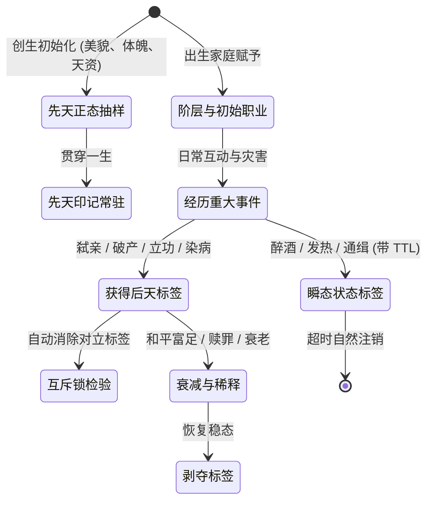

# 基于LLM的世界架构模型：NPC标签化系统与初步标签数据库规范 (NPC Tag & Trait Ontology Database)
## —— 荀子六情、林传鼎十八脾气、尧谷子七十二品性格、正态分布量化属性与长尾概率分配大系

---

### 目录 (Table of Contents)
1. **NPC 标签化系统设计哲学与工程意义 (Design Philosophy & System Significance)**
2. **古典与本土心理学基础：荀况六情说、林传鼎十八脾气与尧谷子十八型七十二品性格论 (Psychological Foundations: Xunzi, Lin Chuanding & Yao Guzi)**
   - 2.1 荀况（荀子）天情六类论（好、恶、喜、怒、哀、乐）与礼义心智节制
   - 2.2 林传鼎汉语情绪十八类（脾气谱系与动态情绪状态机）
   - 2.3 尧谷子十八型人格与四阶七十二品性格演化论 (18 Types x 4 Tiers = 72 Subtypes)
3. **标签几率生成与分配法则：普通人基底与长尾极化律 (Probability Distribution: The Commoner Majority & Long-Tail Laws)**
   - 3.1 离散特质金字塔阶梯频度法则（普通人占绝大多数，长尾极化分布）
   - 3.2 离散分类抽样算法与齐普夫定律 (Zipfian & Categorical Distribution)
4. **量化属性标签体系与高斯正态分布分配模型 (Quantified Tags & Gaussian Normal Distribution Framework)**
   - 4.1 连续量化标签的正态分布数学模型：$X \sim \mathcal{N}(\mu, \sigma^2)$
   - 4.2 典型量化锚点剖析：美貌评分系统（5.0分普通众生，9.5分顶美出尘，1.0分畸形可怖）
   - 4.3 全局量化属性标签矩阵（美貌、力量、智商、勇气、道德底线、财富资产、酒量耐受）
5. **标签生命周期与动态演化机理 (Tag Lifecycle, Acquisition & Demotion)**
   - 5.1 标签四时态（先天印记、后天经历、瞬态情境、关系羁绊）
   - 5.2 互斥锁与冲突消解原则 (Mutual Exclusion Locks)
6. **标签对多层系统的作用通道 (System Interfacing: Mind, Habits & LLM Prompt)**
7. **NPC 初步标签数据库大全 (Preliminary Tag Database Taxonomy: 八大维度详细分类)**
   - 7.1 大类一：职业、行会与社会阶层标签 (Occupations, Guilds & Social Strata)
   - 7.2 大类二：性格、脾气与道德特质标签 (林传鼎18脾气 + 尧谷子性格 + 大五/HEXACO)
   - 7.3 大类三：生理体魄、天赋与外貌特征标签 (含正态量化美貌/力量)
   - 7.4 大类四：习惯、癖好与物质瘾癖标签 (杜希格回路绑定)
   - 7.5 大类五：心理创伤、情结与潜意识标签 (Tier 5 潜意识与 PTSD)
   - 7.6 大类六：名望、社会声誉与身份羁绊标签 (声望、血仇、继承权)
   - 7.7 大类七：绝密罪行、致命把柄与隐匿弱点标签 (游戏博弈、勒索与任务触发)
   - 7.8 大类八：叙事引力与普罗普戏剧职能标签 (关键角色衣钵与剧情动量)
8. **标签复合协同与立体人格涌现范例 (Tag Synergy & Emergent Personas)**
9. **工程实现规范与紧凑位掩码检索 (Bitmask Implementation & Storage Schema)**

---

## 1. NPC 标签化系统设计哲学与工程意义 (Design Philosophy & System Significance)

在复杂的虚拟世界与游戏系统设计中，NPC 不能仅仅依赖连续浮点张量或纯自然语言描述：
*   **若全靠自然语言 Prompt 描述**：导致 Token 冗余膨胀、每次推理耗时巨大、大模型对性格和技能的遵守存在幻觉波动；
*   **若全靠连续心智向量 (如 35D 张量)**：连续数值擅长表达连续情绪流转（如疲劳、饥饿、愤怒），但**极度缺乏离散语义可解释性**，无法直观表征“这人是个铁匠、嗜酒如命、曾经杀过人、贪婪吝啬”。

**NPC 标签化（Tagging / Trait Ontology）是连接连续心智与离散语义的枢纽**：
1.  **高维语义离散化**：将复杂的社会身份、生理特质、道德倾向抽象为标准化的元数据标签；
2.  **Tier 1 零开销检索 (0 Token)**：标签在底层映射为整数 ID 或 64/128 位位掩码 (Bitmask)，规则引擎与习惯匹配在 $<0.01ms$ 内通过位运算（`Tag & TAG_GREEDY`）完成极速筛选判定；
3.  **大模型 Prompt 动态拼装模板**：每个标签绑定标准化的自然语言注入片段与行动禁忌，openJiuwen 路由可在数毫秒内组装出高度一致、杜绝自相矛盾的 NPC 角色设定卡。

---

## 2. 古典与本土心理学基础：荀况六情说、林传鼎十八脾气与尧谷子十八型七十二品性格论

为了让世界模型的人性表征不仅具备西方认知科学的严密性，更具备东方文明深厚的人性洞察与文化质感，系统吸收了三套经典本土心理学与哲学体系：

### 2.1 荀况（荀子）天情六类论与礼义心智节制
荀子在《荀子·天论》与《荀子·正名》中确立了中国古典心理学的基石：“性之好、恶、喜、怒、哀、乐谓之情”。
*   **天情六类 (The Six Primordial Affects)**：
    1.  **好 (Affection / Desire)**：对外部客体的接纳、欲求与依恋本能；
    2.  **恶 (Aversion / Disgust)**：对排斥客体、污秽与威胁的本能厌恶；
    3.  **喜 (Joy)**：目标达成、获利或欲望满足时的上升期愉悦；
    4.  **怒 (Anger)**：目标受阻、自尊受创或边界被侵犯时的进攻攻击冲动；
    5.  **哀 (Sorrow)**：失去依恋客体、重大挫败时的能量衰竭与抑郁内敛；
    6.  **乐 (Pleasure / Contentment)**：处于持续安泰、无匮乏环境下的漫延性身心松弛。
*   **心智控制论映射**：荀子指出“情者，性之质也；欲者，情之应也”。六情是人类生而具有的内生原力，若无前额叶“礼义（抑制带宽 $\theta'_{PFC}$）”的教化引导，必然导致霍布斯式的社会争夺冲突；六情在心智张量中直接映射为 Tier 1 与 Tier 2 的动态能量源泉。

### 2.2 林传鼎汉语情绪十八类（脾气谱系与动态情绪状态机）
1944年，中国现代心理学家林传鼎通过对《说文解字》中 9395 个篆字的系统心理学筛查，提炼出 354 个描述情绪的汉字，并归纳出**中国人精神世界与脾气气质的 18 类经典情绪模型**。本系统将其作为 NPC 日常脾气气质与动态情绪状态机的离散分类标准：

| 脾气/情绪分类 | 心理动力学定义 | 心智张量投影参数 | 典型行为与微动作表现 |
|---|---|---|---|
| **1. 安静 (Serenity)** | 心境平和、内无波澜、各系统维持基准稳态 | 唤醒度 $e_A \le 0.2$, 支配度 $e_D \approx 0.5$ | 呼吸匀缓，目光平视，步履稳健 |
| **2. 喜悦 (Delight)** | 目标达成或意外收获带来的正面高唤醒 | 愉悦度 $e_P \ge 0.8$, 唤醒度 $e_A \ge 0.6$ | 眉飞色舞，嘴角大幅上扬 (AU12)，语调轻快 |
| **3. 愤怒 (Rage)** | 边界被踩踏、利益被剥夺引发的强进攻性 | 支配度 $e_D \ge 0.8$, 唤醒度 $e_A \ge 0.9$ | 咬牙切齿，怒目圆睁 (AU4+AU5)，握拳逼近 |
| **4. 哀怜 (Sympathetic Pity)** | 见他人受难引发的同理性悲悯与保护欲 | 愉悦度负偏，依恋情结 $s_5$ 激活 | 眉头微颦，叹气，主动递予水或食物 |
| **5. 悲痛 (Grief)** | 遭遇亲人逝去、毁灭性打击的深层痛苦 | 愉悦度 $e_P \le -0.9$, 疲劳虚无 $p_3$ 激增 | 伏地痛哭，双肩颤抖，对外界刺激麻木迟钝 |
| **6. 忧愁 (Melancholy / Worry)** | 对未来不确定威胁的持续慢性悬虑 | 异位稳态负荷 $L$ 升高，皮质醇持续偏高 | 眉头深锁，长吁短叹，辗转反侧难以入眠 |
| **7. 愤急 (Impatient Indignation)**| 急躁难耐伴随轻度怒意，容忍度极低 | 唤醒度高，前额叶意志带宽 $\theta'_{PFC}$ 骤降 | 频繁跺脚，打断对方说话，语气粗暴逼问 |
| **8. 烦闷 (Dysphoria / Boredom)**| 环境单调乏味或琐事缠身引起的心理窒息感 | 愉悦度微负，多巴胺基准线偏低 | 抓挠头皮，托腮走神，无意识敲击桌面 |
| **9. 恐惧 (Terror)** | 面临直接生命危险时的强烈逃生冲动 | 支配度 $e_D \le 0.1$, 恐慌临界值突破 | 瞳孔放大，面色苍白，沿斥力场向后跌撞逃窜 |
| **10. 惊骇 (Shock / Consternation)**| 遭遇极端突发超预期事件的瞬间认知瘫痪 | 预测误差 $PE$ 瞬间爆表，工作记忆挂起 | 倒吸冷气，身体僵直，下巴脱臼式微张 (AU26) |
| **11. 恭敬 (Reverence / Respect)** | 对高社会资本/崇高威权的顺从与景仰 | 支配度自抑 $e_D \le 0.3$, 诚实度 $H$ 显现 | 低头欠身，双手垂立，语调谦卑柔和 |
| **12. 抚爱 (Tenderness / Affection)**| 对幼小、伴侣的慈爱抚慰与亲密荷尔蒙 | 催产素分泌，主观感知亲缘度 $\hat{r}$ 激增 | 眼神温润，轻拍肩背或抚摸头部，柔声细语 |
| **13. 憎恶 (Loathing / Abhorrence)**| 对违背道德或生理恶心对象的极度拒斥 | 厌恶度极高，达马西奥躯体标记警报 | 皱鼻缩唇 (AU9+AU10)，侧头扭避，啐唾沫 |
| **14. 贪欲 (Covetous Greed)** | 对金钱、权力或肉欲的不可遏制占有欲 | 享乐适应率 $\kappa$ 狂飙，损失厌恶畸变 | 目光死盯目标，喉头微动，手指反复摩挲 |
| **15. 嫉妒 (Envy / Jealousy)** | 目睹同侪拥有自身渴望之物的酸楚怨恨 | 嫉妒度 $e_{jealous} \ge 0.8$, 支配欲受挫 | 斜眼冷视，出言讥讽，暗中盘算破坏计划 |
| **16. 傲慢 (Hubris / Arrogance)** | 极度自恋与阶层优越感，藐视下层凡人 | 支配度 $e_D \ge 0.9$, 自恋补偿 $s_4$ 顶格 | 下巴高抬 (AU17)，鼻孔示人，从鼻腔冷哼 |
| **17. 惭愧 (Compunction / Guilt)**| 自觉能力不足或轻度失信引发的内心歉疚 | 内疚自责 $e_{guilt} \ge 0.6$, 愉悦度微跌 | 眼神回避，耳根泛红，连声告罪，主动让利 |
| **18. 耻辱 (Humiliation / Shame)** | 尊严在公众面前遭遇毁灭性践踏的绝望 | 公开羞耻 $e_{shame} \ge 0.9$, 绝望无助暴增 | 无地自容，垂头抱臂，诱发极端复仇或自戕 |

### 2.3 尧谷子十八型人格与四阶七十二品性格演化论 (18 Types x 4 Tiers = 72 Subtypes)
学者尧谷子提出人格是人性在不同发展层次的展开，提出“积行成习，积习成性，积性成命”的规律，提炼出 **18 种核心人格原型**。本系统将其与**四个心理演进阶梯（四品：初阶萌芽态、常态显现态、强化执念态、极端病理态）**进行交叉笛卡尔积，形成 **$18 \times 4 = 72$ 种性格细分谱系**：

#### 18 大核心人格原型矩阵：
1.  **完美型 (The Perfectionist)**：追求无瑕，严谨守序，对混乱零容忍；
2.  **随和型 (The Agreeable)**：心性恬淡，与人为善，极易妥协适应；
3.  **较真型 (The Tenacious Stickler)**：针对性强，锱铢必较，不达目的誓不罢休；
4.  **活跃型 (The Vibrant Enthusiast)**：开朗外向，精力充沛，情绪切换极快；
5.  **给予型 (The Altruistic Giver)**：乐善好施，先人后己，甚至带有自我牺牲倾向；
6.  **沉思型 (The Contemplative Thinker)**：孤僻内省，重理论轻现实，喜冷眼旁观；
7.  **谨慎型 (The Vigilant Guardian)**：风险厌恶极高，防御优先，未雨绸缪；
8.  **坚毅型 (The Resilient Stoic)**：耐受磨难，沉默承受，逆境中韧性极强；
9.  **进取型 (The Ambitious Striver)**：渴望阶层跃迁，不知疲倦地积累资本与名望；
10. **主导型 (The Dominant Commander)**：强控制欲，天然领导者，习惯发号施令；
11. **防御型 (The Defensive Wall)**：对外界高度设防，缺乏信任，遇刺激先亮尖刺；
12. **怀疑型 (The Skeptical Inquirer)**：怀疑一切表象，探究背后阴谋，轻信度归零；
13. **敏感型 (The Sensitive Empath)**：感官极其敏锐，微小情绪波动即引发巨大共振；
14. **洒脱型 (The Free Spirit)**：蔑视世俗规训，随心所欲，不受物质名利羁绊；
15. **超脱型 (The Transcendent Sage)**：看破红尘因果，情感波动平缓，追求内圣外王；
16. **反叛型 (The Defiant Rebel)**：天然反感建制与权威，以打破既有规则为乐；
17. **包容型 (The All-Embracing Mother)**：宽厚博大，海纳百川，能容忍他人之短；
18. **依恋型 (The Dependent Loyalist)**：需要依附强权或领袖，忠诚度极高，怕被抛弃。

#### 四阶（四品）递进演化深度：
*   **一品·萌芽潜质态 (Seedling, 占 45%)**：特质处于潜意识中，日常与常人无异，仅在特定刺激下隐现；
*   **二品·常态显现态 (Manifested, 占 35%)**：特质已固化为日常习惯言行，成为公众公认的性格底色；
*   **三品·强化执念态 (Obsessive, 占 15%)**：特质压倒大部分前额叶理性，成为指导整个人生道路的执念；
*   **四品·极端病理态 (Pathological, 占 5%)**：特质彻底异化为心理障碍或偏执狂热（如完美型异化为重度强迫症、谨慎型异化为被害妄想症、给予型异化为病态自虐）。

---

## 3. 标签几率生成与分配法则：普通人基底与长尾极化律

真实人类社会不是人人都是绝世剑圣或蛇蝎美人的传奇剧场。在万级规模的虚拟世界中，**绝大多数 NPC 是平庸、普通、守法、劳作的寻常百姓**。

### 3.1 离散特质金字塔阶梯频度法则
系统确立四级概率金字塔结构：

```
                    ▲
                   / \     [传奇/极端长尾 (Extreme/Legendary)] 约 1% ~ 2%
                  /---\    (如: 绝色顶美9.5+、弑亲者、天生神力、恐火PTSD)
                 /                     /-------\   [罕见特质 (Rare)] 约 8% ~ 10%
               /         \  (如: 贪婪成性、嗜酒如命、断指、勇猛无畏)
              /-----------             /             \ [进阶特质 (Uncommon)] 约 20% ~ 25%
            /---------------\(如: 勤勉较真、清秀端正、林间猎户、小有积蓄)
           /                           /-------------------\ [普通人基准基底 (Common / Ordinary)] 约 65% ~ 70%
         /                     \(如: 自耕农、容貌平平5.0、脾气安静随和、守法平庸)
```

1.  **普遍级标签 (Common, 概率 $\ge 65\%$)**：`[容貌_相貌平平]`, `[脾气_安静]`, `[脾气_随和]`, `[职业_自耕农/学徒]`, `[道德_遵纪守法]`, `[习惯_早睡早起]`；
2.  **进阶级标签 (Uncommon, 概率 $20\% \sim 25\%$)**：`[体魄_精壮]`, `[容貌_眉清目秀]`, `[性格_较真]`, `[性格_活跃]`, `[职业_熟练铁匠/行商]`, `[习惯_偶爱买醉]`；
3.  **罕见级标签 (Rare, 概率 $5\% \sim 10\%$)**：`[性格_极度贪婪]`, `[体魄_病弱痨病]`, `[习惯_重度烟瘾]`, `[职业_雇佣兵队长/典当行主]`, `[把柄_偷盗公款]`；
4.  **传奇/极端长尾标签 (Extreme/Legendary, 概率 $<1\% \sim 2\%$)**：`[容貌_倾国倾城 (9.5+)]`, `[容貌_极度丑陋畸形 (1.0)]`, `[体魄_天生神力]`, `[创伤_恐火症PTSD]`, `[罪行_暗夜杀人犯]`, `[血统_真王遗孤]`。

### 3.2 离散分类抽样算法 (Categorical & Zipf Distribution)
对于离散职业与身份标签，其宏观分布遵循齐普夫幂律 (Zipf's Law)：
$$ P(Rank = k) = rac{1 / k^s}{\sum_{n=1}^N (1 / n^s)}, \quad s pprox 1.15 $$
确保底层农夫（Rank 1）占据数千人，铁匠木匠（Rank 5~10）百余人，而炼金术士、世袭公爵（Rank 50+）在整张地图上屈指可数。

---

## 4. 量化属性标签体系与高斯正态分布分配模型 (Quantified Tags & Gaussian Normal Distribution)

某些属性不能简单地用“有/无”判断，而必须表现为**连续的数值量化刻度**。

### 4.1 正态分布数学模型：$X \sim \mathcal{N}(\mu, \sigma^2)$
所有连续量化标签均采用正态高斯分布进行种群生成，并辅以双向软截断：
$$ f(x) = rac{1}{\sigma \sqrt{2\pi}} \exp\left( - rac{(x - \mu)^2}{2\sigma^2} 
ight), \quad x \in [X_{min}, X_{max}] $$
*   **统一基准刻度**：采用 **$1.0 \sim 10.0$ 分制**；
*   **系统全局设定**：均值 $\mu = 5.0$，标准差 $\sigma = 1.25$；
*   **概率分布特征**：
    *   **$[\mu - \sigma, \mu + \sigma] = [3.75, 6.25]$**：涵盖 **$68.26\%$** 的人口，构成了**压倒性多数的普罗大众**；
    *   **$[\mu - 2\sigma, \mu + 2\sigma] = [2.50, 7.50]$**：涵盖 **$95.44\%$** 的人口；
    *   **$[7.50, 8.75]$**：仅占 **$2.14\%$**，百里挑一的一方翘楚；
    *   **$[8.75, 10.0]$**：仅占 **$0.13\%$**，万里挑一的旷世传奇。

### 4.2 典型量化锚点剖析：美貌评分系统 (Beauty / Attractiveness)
以**美貌度**为例，系统将连续评分直接锚定至生动的世界表现与配偶价值矩阵（MVI）：

| 评分区间 | 概率分位 (CDF) | 称号与标签 | 世界表现与微动作 | 配偶价值 $MVI_F$ 修正 |
|---|---|---|---|---|
| **9.5 ~ 10.0** | **Top 0.02% (万里挑一)** | `QUANT_BEAUTY_PEAK` (**倾国倾城 / 绝代谪仙**) | 五官黄金比例，肤若凝脂，路人目击瞬间心跳加速唤醒度上升，初见好感度底线 +40 | **+200% (顶格)** |
| **8.5 ~ 9.4** | **Top 0.5% (千人拔萃)** | `QUANT_BEAUTY_EXQUISITE` (**惊艳俊美 / 小镇名花**) | 眉目如画，气质出尘，在酒馆集市中极为吸睛，极易引来求偶者决斗 | **+80%** |
| **7.0 ~ 8.4** | **Top 5% (百里清秀)** | `QUANT_BEAUTY_PRETTY` (**清秀端正 / 仪表堂堂**) | 轮廓匀称，神采奕奕，令人心生好感，言语说服成功率提高 15% | **+30%** |
| **4.0 ~ 6.9** | **中间 75% (普罗大众)** | `QUANT_BEAUTY_COMMON` (**相貌平平 / 芸芸众生**) | **5.0 分为绝对标准大众脸**。丢在人群中毫无辨识度，不引发任何负面或正面额外注视 | **基准 0% (中立)** |
| **2.5 ~ 3.9** | **Bottom 5% (粗糙寡淡)** | `QUANT_BEAUTY_PLAIN` (**粗陋枯槁 / 容貌粗俗**) | 皮肤粗糙无光泽，五官局促，在求偶博弈中处于明显劣势 | **-25%** |
| **1.0 ~ 2.4** | **Bottom 0.5% (极丑畸形)** | `QUANT_BEAUTY_HIDEOUS` (**面目可怖 / 奇丑畸形**) | 严重五官错位或大面积胎记脓疮，目击者本能产生轻微厌恶恶心反应 | **-80%** |

### 4.3 全局核心量化属性矩阵

除了美貌度外，系统对以下核心属性同样实施连续正态生成：

1.  **体魄力量 (Physical Strength, $\mu=5.0, \sigma=1.25$)**：
    *   $5.0$：寻常搬运 30 斤麦袋；
    *   $9.5+$：天生神力，单手托举数百斤石碾，近战攻击附带强力击退撕裂；
    *   $1.0$：气虚体弱，走两里路即气喘吁吁。
2.  **悟性智商 (Cognitive Savvy, $\mu=5.0, \sigma=1.25$)**：
    *   $5.0$：市井算账不糊涂，但领悟高深工艺需反复教导数月；
    *   $9.5+$：过目不忘，观星占卜或机关解密瞬间洞察本质，技术树因果研发速度翻倍；
    *   $1.0$：心智迟钝，容易被最拙劣的话术与骗术蒙蔽。
3.  **胆识勇气 (Courage / Fortitude, $\mu=5.0, \sigma=1.25$)**：
    *   $5.0$：遇狼群自发后退抱团，见死尸面露惧色但能稳住；
    *   $9.5+$：泰山崩于前而色不变，被刀架在脖子上依然谈笑风生；
    *   $1.0$：风声鹤唳，一只老鼠窜过即吓得瘫软失禁。
4.  **道德良知 (Moral Strictness, $\mu=5.0, \sigma=1.25$)**：
    *   $5.0$：偶尔占点小便宜，不杀人不放火，遵奉世俗律法；
    *   $9.5+$：绝对利他圣人，宁可自己饿死也不偷一粒麦，麦克白内疚阈值极高；
    *   $1.0$：穷凶极恶反社会人格，杀人越货心中毫无波澜。
5.  **酒量耐受度 (Alcohol Tolerance, $\mu=5.0, \sigma=1.5$)**：
    *   $5.0$：两角麦酒微醺，四角大醉倒地；
    *   $9.5+$：千杯不醉，把烈酒当水喝，醉酒惩罚对前额叶毫无影响；
    *   $1.0$：闻到酒气便满脸通红，半杯见底直接人事不省。
6.  **财富资本分位 (Wealth Rank, 遵循对数正态分布 $	ext{LogNormal}$)**：
    *   财富不服从对称正态分布，而是服从**右偏长尾的对数正态分布**（反映皮凯蒂 $r > g$ 与极端马太效应）：$90\%$ 的人资产在 10~50 铜板之间，仅 $1\%$ 的寡头持有全镇 $80\%$ 的金币。

---

## 5. 标签生命周期与动态演化机理 (Tag Lifecycle, Acquisition & Demotion)



### 5.1 标签四时态划分
1.  **先天印记标签 (Innate)**：遗传、容貌分、力量天赋、夜盲症，生成后不可更改；
2.  **后天经历标签 (Acquired)**：重大人生转折印记（如 `[经历_弑亲者]`、`[经历_破产老赖]`、`[技能_宗师级铁匠]`）；
3.  **瞬态情境标签 (State)**：带有生存时效（TTL），如 `[状态_重度醉酒]`（持续 4 小时）、`[状态_高烧染疫]`、`[状态_被通缉]`；
4.  **关系羁绊标签 (Relational)**：依附于特定社交对象，如 `[亲属_主观私生子]`、`[羁绊_两姓血仇]`。

### 5.2 互斥锁原则 (Mutual Exclusion)
*   `[性格_极度吝啬]` $\iff$ `[性格_慷慨散财]`
*   `[道德_良知圣人]` $\iff$ `[罪行_暗夜凶手]`
*   `[容貌_倾国倾城]` $\iff$ `[容貌_面目可怖]`

---

## 6. 标签对多层系统的作用通道 (System Interfacing)

每个标准标签直接挂接四层系统接口：
1.  **心智修正项 (Mind Modifiers)**：修正 35D 心智张量基准值（如 `[性格_贪婪]` 使财富适应率 $\kappa 	imes 1.5$）；
2.  **行为偏置项 (Action Biases)**：对动作候选概率施加先验加权（如 `[习惯_烟瘾]` 在疲倦时为“点烟”动作赋予 +5.0 效用）；
3.  **微动作与副语言映射 (FACS & Paralinguistics)**：指导端侧 0ms 动作抢跑（如 `[脾气_傲慢]` 默认挂载下巴上扬 AU17 与冷哼声）；
4.  **Prompt 编译模板 (Prompt Injection Template)**：注入鲜明口吻与不可逾越的禁忌。

---

## 7. NPC 初步标签数据库大全 (Preliminary Tag Database Taxonomy)

---

### 7.1 大类一：职业、行会与社会阶层标签 (Occupations & Strata)

#### 1. 手工业与生产工匠
*   `PROF_BLACKSMITH` (**铁匠**)
    *   *描述*：常年打铁锻造，臂力惊人，耐热，身上有煤烟味。
    *   *修正项*：体能上限 +20%，疲劳耐受 +15%，手部有厚老茧。
    *   *Prompt*：“你说话瓮声瓮气，习惯用打铁火候打比方，鄙视弱不禁风的书生。”
*   `PROF_CARPENTER` (**木匠**)：擅长建筑榫卯，对度量空间与木料价格极度敏感。
*   `PROF_LEATHERWORKER` (**制皮匠**)：熟练剥皮鞣制，耐受腐臭，熟知动物皮毛品质。
*   `PROF_ALCHEMIST` (**炼金术士 / 药剂师**)：手指常有化学灼痕，大五神经质高，狂热痴迷毒草矿物。
*   `PROF_MASON` (**石匠**)：采石雕凿，沉默寡言，执拗如石。

#### 2. 农林牧渔与资源开采
*   `PROF_FARMER` (**自耕农 / 佃农**)：靠天吃饭，熟悉节气墒情，损失厌恶系数 $\lambda$ 偏高，极度惜售存粮。
*   `PROF_HUNTER` (**山林猎户**)：擅追踪兽迹，视锥显著性加权 +30%，懂下风向潜伏。
*   `PROF_MINER` (**矿工**)：常年在暗无天日地底劳作，患轻度咳喘，对瓦斯异味极度敏感。
*   `PROF_LUMBERJACK` (**伐木工**)：体格雄健，熟知倒木受力方向。
*   `PROF_FISHERMAN` (**渔夫**)：水性极佳，擅长结网操舟，通晓潮汐。

#### 3. 商业、金融与流通
*   `PROF_MERCHANT_TRAVELING` (**行商 / 骡马客**)：奔走于各村镇，见多识广，善察言观色与压价，掌握多种方言。
*   `PROF_PAWNBROKER` (**典当行掌柜**)：精明冷酷，同情心低，要价禀赋系数计算极度苛刻。
*   `PROF_USURER` (**高利贷放贷者**)：雇凶讨债，账簿利息计算滴水不漏。
*   `PROF_TAVERN_KEEPER` (**酒馆老板**)：情报集散中枢，熟悉三教九流，社交声望广度极高。

#### 4. 武装、治安与地下边缘
*   `PROF_TOWN_GUARD` (**守城卫兵**)：执戈盘查，执行宵禁，崇尚权威，但也容易被小恩小惠收买。
*   `PROF_MERCENARY` (**雇佣兵**)：刀口舔血，只认金币，恐惧阈值高，道德约束低。
*   `PROF_BOUNTY_HUNTER` (**赏金猎人**)：冷血独行，擅长利用巷战设伏捉拿通缉犯。
*   `PROF_THIEF_PICKPOCKET` (**盗贼 / 扒手**)：眼神飘忽，擅长在集市拥挤处割包溜走。
*   `PROF_SMUGGLER` (**走私客**)：熟悉避税密道，在官匪两道均有人脉。

#### 5. 神职、学术与统治
*   `PROF_MONK_PRIEST` (**修道士 / 祭司**)：研习经典，主持忏悔，散发乳香气息。
*   `PROF_SCHOLAR` (**经院学者 / 抄写员**)：通晓古文律法，视力偏弱，身上有墨水味。
*   `PROF_HERBAL_WITCH` (**林间草药姑 / 灵媒**)：被正统教会排斥，擅古法接生与蛇毒占卜。
*   `PROF_FEUDAL_LORD` (**世袭领主 / 骑士**)：自持高贵，拥有征税权，极力维护家族声誉。
*   `PROF_TAX_COLLECTOR` (**包税官**)：持账簿强索赋税，民怨极深。

#### 6. 底层流民与贱民
*   `PROF_BEGGAR` (**沿街乞丐**)：衣衫褴褛，擅装残装怜，暗充小偷耳目。
*   `PROF_BARD` (**流浪吟游诗人**)：抱鲁特琴走天涯，以编造英雄艳情史诗换酒钱。

---

### 7.2 大类二：性格、脾气与道德特质标签 (林传鼎18脾气 + 尧谷子性格)

#### 1. 林传鼎脾气标签族 (Temperament Traits)
*   `TEMP_SERENE` (**脾气·安静**)：遇变不惊，语速舒缓，情绪温度 $	au$ 低。
*   `TEMP_JOYFUL` (**脾气·喜悦**)：天生乐天派，欢声笑语，极易被小事逗乐。
*   `TEMP_WRATHFUL` (**脾气·愤怒**)：一点就着，暴躁好斗，攻击倾向常态加成。
*   `TEMP_PITYING` (**脾气·哀怜**)：心软见不得他人受难，极易施舍或代为求情。
*   `TEMP_MELANCHOLIC` (**脾气·忧愁**)：多愁善感，杞人忧天，眉头常锁。
*   `TEMP_HASTY` (**脾气·愤急**)：急性子，容忍度极低，说话连珠炮。
*   `TEMP_TIMID` (**脾气·恐惧**)：草木皆兵，夜间不敢独行。
*   `TEMP_REVERENT` (**脾气·恭敬**)：对长辈领主毕恭毕敬，极讲规矩礼数。
*   `TEMP_LOATHING` (**脾气·憎恶**)：洁癖排他，对异类或违规者毫不掩饰嫌恶。
*   `TEMP_JEALOUS` (**脾气·嫉妒**)：见不得邻里发财，言语泛酸，容易背后放冷箭。
*   `TEMP_ARROGANT` (**脾气·傲慢**)：鼻孔朝天，视平民为蝼蚁草芥。
*   `TEMP_ASHAMED` (**脾气·惭愧/耻辱**)：自尊心脆弱，稍遭批评便面红耳赤或自暴自弃。

#### 2. 尧谷子性格特质族 (Yao Guzi 18 Core Types)
*   `YAO_PERFECTIONIST` (**尧氏·完美型**)：严苛刻板，见不得器物摆放不正或账目差一文钱。
*   `YAO_STICKLER` (**尧氏·较真型**)：认死理，即使为三文钱也要告到公堂。
*   `YAO_AGREEABLE` (**尧氏·随和型**)：怎么样都行，极好说话，容易被他人推着走。
*   `YAO_GIVER` (**尧氏·给予型**)：恨不得掏心掏肺帮人，宁可自己挨饿。
*   `YAO_VIGILANT` (**尧氏·谨慎型**)：进门必先看后路，睡觉必压刀在枕下。
*   `YAO_REBEL` (**尧氏·反叛型**)：官府禁什么他偏做什么，以破坏旧秩序为快感。
*   `YAO_LOYALIST` (**尧氏·依恋型**)：必须追随一个强力主子才能安心过活。

---

### 7.3 大类三：生理体魄、天赋与外貌特征标签 (含正态量化)

*   `QUANT_BEAUTY` (**量化·美貌度**, $X \sim \mathcal{N}(5.0, 1.25^2)$)：
    *   $9.5 \sim 10.0$：`[倾国倾城]`，绝代顶美，初见好感度底线大幅提高；
    *   $5.0$：`[相貌平平]`，大众脸；
    *   $1.0 \sim 2.0$：`[面目可怖]`，严重畸形丑陋。
*   `QUANT_STRENGTH` (**量化·体魄力量**, $X \sim \mathcal{N}(5.0, 1.25^2)$)：
    *   $9.5+$：`[天生神力]`，双臂有千斤之力；
    *   $1.0$：`[弱不禁风]`，肌无力病弱。
*   `PHYS_SCAR_FACE` (**面部狰狞刀疤**)：威慑力 +30%，极易被辨认。
*   `PHYS_ONE_EYED` (**盲独目**)：存在 $60^\circ$ 永久视野盲区。
*   `PHYS_LIMP` (**跛足瘸腿**)：移动速度降低 40%。
*   `PHYS_NIGHT_BLIND` (**夜盲症**)：入夜后视锥范围缩至 2 米。

---

### 7.4 大类四：习惯、癖好与物质瘾癖标签 (杜希格回路)

*   `HABIT_ALCOHOLIC` (**嗜酒如命**)：黄昏路过酒馆必去买醉，不喝则手抖心慌。
*   `HABIT_SMOKER` (**烟斗烟瘾**)：工歇必摸烟斗深吸一口，获得心理镇定。
*   `HABIT_GAMBLER` (**赌博成瘾**)：嗜赌如命，越输越想加倍下注翻本。
*   `HABIT_COMPULSIVE_WASHER` (**强迫洗手洁癖**)：触摸脏污或做亏心事后疯狂搓手。
*   `HABIT_FIDGE_LEG` (**焦虑抖腿**)：等待时高频无意识抖腿。
*   `HABIT_MAGPIE_HOARDER` (**喜鹊癖**)：忍不住随手偷藏闪光小石子或碎铜片。

---

### 7.5 大类五：心理创伤、情结与潜意识标签 (Tier 5 潜意识)

*   `TRAUMA_PYROPHOBIA` (**恐火症**)：曾遭火灾，见明火火把尖叫失控。
*   `TRAUMA_CLAUSTROPHOBIA` (**幽闭恐惧**)：曾困矿坑，身处窄室窒息窒息感爆表。
*   `TRAUMA_BETRAYAL_PTSD` (**背叛创伤**)：曾被至亲出卖，不再相信任何人。
*   `COMPLEX_OEDIPUS` (**恋母/敌视父权情结**)：下意识仇视一切年长权威。
*   `COMPLEX_INFERIORITY_COMPENSATION` (**自卑补偿狂妄**)：出身微贱但得权后穷凶极恶。
*   `COMPLEX_MESSIAH` (**救世主狂妄**)：深信自己肩负救世神谕，渴求悲壮牺牲。

---

### 7.6 大类六：名望、社会声誉与身份羁绊标签

*   `REP_HERO_OF_VALLEY` (**平民英雄**)：斩杀恶狼扬名，村民敬重折价。
*   `REP_KINSLAYER` (**弑亲恶名**)：遭全村唾弃的悖逆之徒。
*   `LINEAGE_BASTARD` (**大公私生子**)：身怀家族信物胎记，被正统追杀。
*   `BOND_BLOOD_FEUD` (**两姓世仇**)：背负宗族宿怨，相见必拔刀。
*   `BOND_SWORN_BROTHER` (**金兰义兄弟**)：主观亲缘 $\hat{r} = 1.0$，愿以命相护。

---

### 7.7 大类七：绝密罪行、致命把柄与隐匿弱点标签 (游戏博弈专属)

*   `SECRET_MURDERER` (**暗夜杀人凶手**)：曾在枯井掐死同僚，可被骨骸信物勒索全副身家。
*   `SECRET_FORGED_COIN` (**地窖私铸劣币**)：秘密熔铅铸假币，告发即绞刑。
*   `SECRET_ILLEGITIMATE_HEIR` (**私藏真王血脉**)：抚养的农女实为先皇独女。
*   `WEAKNESS_RAT_PHOBIA` (**极度恐鼠**)：魁梧大汉见老鼠吓瘫。
*   `WEAKNESS_FATAL_ALLERGY` (**白果致命过敏**)：误食微量白果十分钟喉头水肿气绝。

---

### 7.8 大类八：叙事引力与普罗普戏剧职能标签

*   `MANTLE_DISPATCHER` (**普罗普·派遣者**)：掌远征号召权，向英雄发布宏观主线任务。
*   `MANTLE_DONOR` (**普罗普·赠与者/导师**)：掌绝世图谱与神庙密匙，设试炼传艺。
*   `MANTLE_HELPER` (**普罗普·助手**)：前线掩护或后勤线策应。
*   `MANTLE_VILLAIN` (**普罗普·宿敌反派**)：推高世界张力顶峰。
*   `MANTLE_SUCCESSOR_BOUND` (**普罗普·衣钵法定继承人**)：死者信物与未竟复仇第一顺位接盘人。

---

## 8. 标签复合协同与立体人格涌现范例 (Tag Synergy & Emergent Personas)

### 案例一：小镇顶美却暗藏弑夫秘密的冷艳药剂师（艾琳）
*   **标签组合**：
    *   `PROF_ALCHEMIST` (药剂师)
    *   `QUANT_BEAUTY` = **9.6分** (`[倾国倾城 / 绝代顶美]`)
    *   `TEMP_SERENE` (脾气·安静，情绪喜怒不形于色)
    *   `YAO_VIGILANT` (尧氏·谨慎型三品执念)
    *   `SECRET_MURDERER` (三年前用无色夹竹桃毒毙家暴的前夫)
    *   `HABIT_COMPULSIVE_WASHER` (频繁洗手洁癖)
*   **交互涌现效果**：
    *   平日在药铺柜台前容貌惊艳绝伦，求药搭讪的青年踏破门槛，但她态度极度清冷寡言（安静脾气）；
    *   玩家若在后山旧墓翻出夹竹桃枯根并出示，艾琳手部瞬间颤抖失控，在水盆疯狂搓洗（洗手洁癖爆发），压低嗓音愿意赠送绝版剧毒配方换取玩家闭口不言。

### 案例二：貌不惊人却忠勇过人的断指老兵巡夜长（巴恩斯）
*   **标签组合**：
    *   `PROF_TOWN_GUARD` (守城卫兵巡夜长)
    *   `QUANT_BEAUTY` = **4.8分** (`[相貌平平]`)
    *   `QUANT_STRENGTH` = **8.8分** (`[精壮雄浑]`)
    *   `TEMP_HASTY` (脾气·愤急，急性子)
    *   `PHYS_MISSING_FINGERS` (右手断食指)
    *   `HABIT_ALCOHOLIC` (爱喝烈麦酒)
    *   `BOND_BLOOD_FEUD` (与城外黑风山贼有杀弟血仇)
    *   `MANTLE_HELPER` (主线攻城战中充当开门内应)
*   **交互涌现效果**：
    *   长相丢人堆里找不着，说话急躁粗门大嗓，动辄骂骂咧咧；
    *   但遭遇山贼夜袭时战力爆发，手握断头大斧如黑旋风般死战不退，是玩家攻陷山寨最可靠的正面盟友。

---

## 9. 工程实现规范与紧凑位掩码检索 (Bitmask Implementation & Storage Schema)

### 9.1 JSON Schema 规范定义
```json
{
  "$schema": "http://json-schema.org/draft-07/schema#",
  "title": "NPCTagProfile",
  "type": "object",
  "properties": {
    "entity_id": { "type": "string", "format": "uuid" },
    "quantified_attributes": {
      "type": "object",
      "properties": {
        "beauty": { "type": "number", "minimum": 1.0, "maximum": 10.0 },
        "strength": { "type": "number", "minimum": 1.0, "maximum": 10.0 },
        "savvy": { "type": "number", "minimum": 1.0, "maximum": 10.0 },
        "courage": { "type": "number", "minimum": 1.0, "maximum": 10.0 },
        "morality": { "type": "number", "minimum": 1.0, "maximum": 10.0 }
      },
      "required": ["beauty", "strength", "savvy", "courage", "morality"]
    },
    "temperament_18": { "type": "string" },
    "personality_72": { "type": "string" },
    "innate_tags": { "type": "array", "items": { "type": "string" } },
    "acquired_tags": { "type": "array", "items": { "type": "string" } },
    "state_tags": {
      "type": "array",
      "items": {
        "type": "object",
        "properties": {
          "tag": { "type": "string" },
          "expires_at_tick": { "type": "integer" }
        }
      }
    },
    "secrets": { "type": "array", "items": { "type": "string" } },
    "narrative_mantle": { "type": "string", "nullable": true }
  },
  "required": ["entity_id", "quantified_attributes", "temperament_18", "personality_72"]
}
```

### 9.2 Tier 1 位掩码与连续正态采样实现 (C/C++ 伪代码)
```c
// 64位离散高频特征掩码
#define MASK_PROF_BLACKSMITH  (1ULL << 0)
#define MASK_TEMP_WRATHFUL    (1ULL << 1)
#define MASK_HABIT_ALCOHOLIC  (1ULL << 2)
#define MASK_SECRET_MURDERER  (1ULL << 3)
#define MASK_MANTLE_HERO      (1ULL << 4)

// Box-Muller 正态分布采样器
float sample_normal(float mu, float sigma, float min_val, float max_val) {
    float u1 = (float)rand() / (float)RAND_MAX;
    float u2 = (float)rand() / (float)RAND_MAX;
    float z0 = sqrtf(-2.0f * logf(u1 + 1e-7f)) * cosf(2.0f * 3.14159265f * u2);
    float val = mu + z0 * sigma;
    if (val < min_val) val = min_val;
    if (val > max_val) val = max_val;
    return val;
}

// 快速判定：是否是可以被美酒攻破防线的暴躁铁匠？
inline bool is_bribable_wrathful_smith(uint64_t mask) {
    uint64_t required = MASK_PROF_BLACKSMITH | MASK_TEMP_WRATHFUL | MASK_HABIT_ALCOHOLIC;
    return (mask & required) == required;
}
```

---
*本规范为世界模型中智能体特征标签库的权威标准，将荀子六情、林传鼎18脾气、尧谷子72性格与正态分布量化属性完整统一。*
