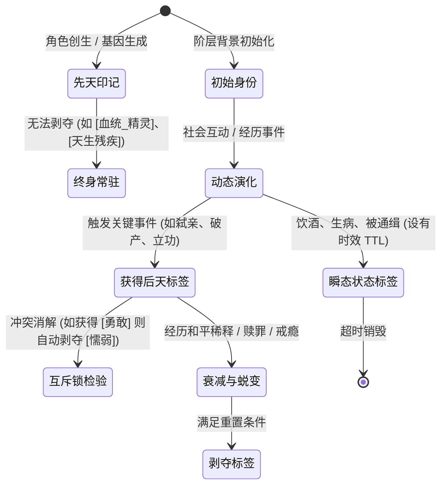

# 基于LLM的世界架构模型：NPC标签化系统与初步标签数据库规范 (NPC Tag & Trait Ontology Database)
## —— 多维离散特征空间、动态标签演化、心智数值修饰与初步标签库全编

---

### 目录 (Table of Contents)
1. **NPC 标签化系统设计哲学与工程意义 (Design Philosophy & System Significance)**
2. **标签生命周期与动态演化机理 (Tag Lifecycle, Acquisition & Demotion)**
3. **标签对多层系统的作用通道 (System Interfacing: Mind, Habits & LLM Prompt)**
4. **NPC 初步标签数据库大全 (Preliminary Tag Database Taxonomy)**
   - 4.1 大类一：职业、行会与社会阶层标签 (Occupations, Guilds & Social Strata)
   - 4.2 大类二：性格、道德与心智特质标签 (Personality, Morality & Virtues/Vices)
   - 4.3 大类三：生理体魄、天赋与外貌特征标签 (Physiology, Talents & Physical Traits)
   - 4.4 大类四：习惯、癖好与物质瘾癖标签 (Habits, Quirks & Addictions - 杜希格回路绑定)
   - 4.5 大类五：心理创伤、情结与潜意识标签 (Trauma, Complexes & Subconscious Shadows)
   - 4.6 大类六：名望、社会声誉与身份羁绊标签 (Reputation, Lineage & Social Bonds)
   - 4.7 大类七：绝密罪行、致命把柄与隐匿弱点标签 (Secrets, Crimes & Leverage - 游戏博弈专属)
   - 4.8 大类八：叙事引力与普罗普戏剧职能标签 (Narrative Mantle & Dramatic Gravity)
5. **标签复合协同与立体人格涌现范例 (Tag Synergy & Emergent Personas)**
6. **工程实现规范与位掩码快速检索 (Bitmask Implementation & Schema)**

---

## 1. NPC 标签化系统设计哲学与工程意义 (Design Philosophy & System Significance)

在复杂的虚拟世界与游戏系统设计中，NPC 不能仅仅依赖连续浮点张量或纯自然语言描述：
*   **若全靠自然语言 Prompt 描述**：导致 Token 冗余膨胀、每次推理耗时巨大、大模型对性格和技能的遵守存在幻觉波动；
*   **若全靠连续心智向量 (如 35D 张量)**：连续数值擅长表达连续情绪流转（如疲劳、饥饿、愤怒），但**极度缺乏离散语义可解释性**，无法直观表征“这人是个铁匠、嗜酒如命、曾经杀过人、贪婪吝啬”。

**NPC 标签化（Tagging / Trait Ontology）是连接连续心智与离散语义的枢纽**：
1.  **高维语义离散化**：将复杂的社会身份、生理特质、道德倾向抽象为标准化的元数据标签；
2.  **Tier 1 零开销检索 (0 Token)**：标签在底层映射为整数 ID 或 64/128 位位掩码 (Bitmask)，规则引擎与习惯匹配在 $<0.01ms$ 内通过位运算（`Tag & TAG_GREEDY`）完成极速筛选判定；
3.  **大模型 Prompt 动态拼装模板**：每个标签绑定标准化的自然语言注入片段与行动禁忌，openJiuwen 路由可在数毫秒内组装出高度一致、杜绝自相矛盾的 NPC 角色设定卡。

---

## 2. 标签生命周期与动态演化机理 (Tag Lifecycle, Acquisition & Demotion)

标签绝非一成不变的静态贴纸，而是一个具备动态生成、衰减、冲突互斥与强化的生机系统：



### 2.1 标签四大时态分类
1.  **先天印记标签 (Innate Tags)**：遗传、种族、体质天赋、先天缺陷，生命周期贯穿一生；
2.  **后天经历标签 (Acquired Tags)**：因重大生活事件（屠村生还、背信弃义、学徒出师、获得封爵）而永久或半永久写入；
3.  **瞬态情境标签 (State / Ephemeral Tags)**：带有生存时间（TTL），如 `[状态_重度醉酒]`、`[状态_发热染疫]`、`[状态_赏金通缉]`；
4.  **关系羁绊标签 (Relational Tags)**：依附于特定社交对象，如 `[亲属_主观私生子]`、`[羁绊_两姓血仇]`、`[师徒_恩师]`。

### 2.2 互斥锁与冲突消解原则 (Mutual Exclusion Locks)
标签系统设置严格的互斥规则组，防止逻辑冲突：
*   `[性格_极度吝啬]` $\iff$ `[性格_挥金如土]`（互斥，不可共存）；
*   `[道德_圣洁虔诚]` $\iff$ `[罪行_亵渎圣物]`（若同时获得，触发严重认知失调并强制替换）；
*   `[生理_天生神力]` $\iff$ `[生理_肌无力症]`（互斥）。

---

## 3. 标签对多层系统的作用通道 (System Interfacing)

每个标准标签包含四层技术挂接接口：
1.  **心智修正项 (Mind Modifiers)**：对 35D 心智张量基准值施加固定偏移或敏感度乘数（例如 `[性格_贪婪]` 使财富适应速率 $\kappa$ 增加 50%）；
2.  **行为偏置项 (Action Biases)**：对候选动作库输出概率施加先验加权（例如 `[习惯_烟瘾]` 在疲劳时为“抽烟”动作赋予 +5.0 效用）；
3.  **微动作与副语言映射 (FACS & Paralinguistic Mapping)**：指导端侧 0ms 动作抢跑（例如 `[性格_轻蔑]` 默认挂载非对称嘴角收紧 AU14）；
4.  **Prompt 编译模板 (Prompt Injection Template)**：向大模型注入鲜明的行为约束与对话口吻。

---

## 4. NPC 初步标签数据库大全 (Preliminary Tag Database Taxonomy)

---

### 4.1 大类一：职业、行会与社会阶层标签 (Occupations, Guilds & Social Strata)

#### 1. 手工业与生产工匠
*   `PROF_BLACKSMITH` (**铁匠**)
    *   *描述*：常年打铁锻造，臂力惊人，耐热，身上有煤烟味。
    *   *修正项*：体能上限 +20%，疲劳耐受 +15%，手部有老茧。
    *   *Prompt*：“你说话瓮声瓮气，习惯用打铁和火候作比喻，鄙视手无缚鸡之力的文弱之辈。”
*   `PROF_CARPENTER` (**木匠**)
    *   *描述*：擅长结构营造与榫卯木工，对度量空间敏感。
    *   *修正项*：空间记忆精度 +10%，对木材与工具价格极为敏感。
*   `PROF_LEATHERWORKER` (**制皮匠**)
    *   *描述*：熟练剥皮鞣制，耐受腐臭气味，熟知动物皮毛品质。
*   `PROF_ALCHEMIST` (**炼金术士 / 药剂师**)
    *   *描述*：研究草药、矿物与试剂，指尖常有化学灼痕，神情神经质。
    *   *修正项*：毒素耐受 +20%，大五人格神经质 +0.2，好奇心极高。
    *   *Prompt*：“你说话语速飞快，时常自言自语，对罕见动植物残骸抱有病态的狂热。”
*   `PROF_MASON` (**石匠**)
    *   *描述*：开山采石、砌筑城墙，沉默寡言，性格如磐石般执拗。

#### 2. 农林牧渔与资源开采
*   `PROF_FARMER` (**自耕农 / 佃农**)
    *   *描述*：靠天吃饭，熟悉节气、积温与墒情，极度依恋土地。
    *   *修正项*：损失厌恶系数 $\lambda$ 偏高（极度惜售粮食），日出而作日落而息。
*   `PROF_HUNTER` (**山林猎户**)
    *   *描述*：擅长追踪兽迹、下夹设套，嗅觉敏锐，懂下风向隐匿。
    *   *修正项*：视锥显著性加权 +30%，下风向潜行判定优势。
*   `PROF_MINER` (**矿工**)
    *   *描述*：常年在不见天日的矿坑劳作，背部微驼，患有轻度尘肺咳喘，对瓦斯异味极度警觉。
*   `PROF_LUMBERJACK` (**伐木工**)
    *   *描述*：森林开拓者，体魄强健，熟知树木纹理与倒木方向。
*   `PROF_FISHERMAN` (**渔夫**)
    *   *描述*：水性极佳，擅长结网辨识水流，手掌粗糙。

#### 3. 商业、金融与流通
*   `PROF_MERCHANT_TRAVELING` (**行商 / 骡马队贩子**)
    *   *描述*：奔波于村落城镇之间，见多识广，善于察言观色与压价。
    *   *修正项*：通用语词义保真度高，方言理解力极强，社交资本流通快。
*   `PROF_PAWNBROKER` (**典当行掌柜**)
    *   *描述*：精明冷酷，擅长利用他人绝境压低抵押物价值。
    *   *修正项*：同情心 -0.4，要价禀赋系数计算极度精确。
*   `PROF_USURER` (**高利贷放贷者**)
    *   *描述*：资本操盘者，雇佣打手收账，对账簿与利息了如指掌。
*   `PROF_TAVERN_KEEPER` (**酒馆老板**)
    *   *描述*：镇上的信息集散地中枢，熟悉三教九流，听风辨雨。
    *   *修正项*：社交声望网络广度极高，记忆短期传闻能力强。

#### 4. 武装、治安与地下边缘
*   `PROF_TOWN_GUARD` (**城镇守卫**)
    *   *描述*：佩带官家兵器，执行宵禁与城门盘查，崇尚权威，但也容易被小恩小惠打动。
*   `PROF_MERCENARY` (**雇佣兵**)
    *   *描述*：刀口舔血，只认金币不认阵营，随身携带磨刀石与护身符。
    *   *修正项*：恐惧阈值高，对战争创伤有一定抗性，道德约束低。
*   `PROF_BOUNTY_HUNTER` (**赏金猎人**)
    *   *描述*：追踪通缉犯，行事孤僻冷血，擅长利用城市暗巷设伏。
*   `PROF_THIEF_PICKPOCKET` (**盗贼 / 扒手**)
    *   *描述*：身手矫健，眼神飘忽，擅长在拥挤集市利用盲区割包。
*   `PROF_SMUGGLER` (**走私客**)
    *   *描述*：熟悉避税小道与暗礁暗门，与黑白两道均有隐秘契约。

#### 5. 神职、学术与统治
*   `PROF_MONK_PRIEST` (**修道士 / 祭司**)
    *   *描述*：研读教典，主持忏悔仪式，身穿粗麻僧袍，散发乳香气息。
*   `PROF_SCHOLAR` (**经院学者 / 抄写员**)
    *   *描述*：掌握古文字与律法图谱，视力偏弱，身上有墨水渍。
*   `PROF_HERBAL_WITCH` (**林间草药姑 / 灵媒**)
    *   *描述*：被正统教会视为异端边缘，掌握古法接生、蛇毒草药与占卜。
*   `PROF_FEUDAL_LORD` (**世袭领主 / 骑士**)
    *   *描述*：拥有土地封号与征税权，自视高贵，极度维护家族声望。
*   `PROF_TAX_COLLECTOR` (**包税官 / 执达吏**)
    *   *描述*：手持账本与算盘，受领主委托强行索要赋税，民怨极深。

#### 6. 底层流民与贱民
*   `PROF_BEGGAR` (**沿街乞丐**)
    *   *描述*：衣衫褴褛，擅长装可怜乞讨，暗中充当小偷的情报耳目。
*   `PROF_BARD` (**流浪吟游诗人**)
    *   *描述*：弹奏鲁特琴，四海为家，以传唱英雄史诗与编造艳情绯闻为生。

---

### 4.2 大类二：性格、道德与心智特质标签 (Personality, Morality & Virtues/Vices)

#### 1. 财富与欲望轴
*   `TRAIT_GREEDY` (**贪婪成性**)
    *   *定义*：视财如命，永远不满足于现状。
    *   *心智修饰*：享乐适应率 $\kappa 	imes 1.5$（财富刺激飞速褪色），议价让步意愿 -0.4。
    *   *互斥*：`TRAIT_GENEROUS`, `TRAIT_ASCETIC`。
*   `TRAIT_MISER` (**铁公鸡 / 吝啬**)
    *   *定义*：极度不愿付出任何实际物质，出售物品要价超过 3 倍。
    *   *心智修饰*：损失厌恶系数 $\lambda = 3.0$。
*   `TRAIT_GENEROUS` (**慷慨大方**)
    *   *定义*：乐于散财资助穷困者，视金钱为维系友谊的工具。
    *   *心智修饰*：社会资本转化效率提高 30%，财富储存偏好低。
*   `TRAIT_ASCETIC` (**苦行禁欲**)
    *   *定义*：自愿放弃物质享乐与美食，以身体受苦磨砺灵魂。
    *   *心智修饰*：饥饿/寒冷产生的达马西奥躯体惩罚降低 50%。

#### 2. 胆识与生存轴
*   `TRAIT_COWARD` (**胆小如鼠**)
    *   *定义*：遇险瞬间恐慌，极易触发逃跑或跪地求饶。
    *   *心智修饰*：恐慌临界阈值降低 60%，唤醒度 $e_A$ 在受到惊吓时飙升。
    *   *互斥*：`TRAIT_BRAVE`。
*   `TRAIT_BRAVE` (**勇猛无畏**)
    *   *定义*：面对强敌或猛兽不退缩，将危险视为证明勇气的机会。
    *   *心智修饰*：战损溃逃阈值提高 40%，意志力前额叶带宽稳定。
*   `TRAIT_PRUDENT` (**审慎周密 / 谨小慎微**)
    *   *定义*：行事必先三思，反复确认撤退路线，绝不轻信陌生人。
    *   *Prompt*：“你对一切提议都抱有怀疑，总在寻找话语中的漏洞与潜在风险。”

#### 3. 道德与人际轴
*   `TRAIT_CRUEL` (**残忍嗜血**)
    *   *定义*：目睹他人的痛苦与鲜血会产生病态的愉悦感。
    *   *心智修饰*：惩罚他人的行动效用大幅提升，内疚值 $e_{guilt}$ 产生率归零。
    *   *互斥*：`TRAIT_COMPASSIONATE`。
*   `TRAIT_COMPASSIONATE` (**悲天悯人 / 仁厚**)
    *   *定义*：对弱者有强烈的同理心，见不得杀生与受虐。
    *   *心智修饰*：目睹暴行时预测误差与失调压力飙升，容易触发干预。
*   `TRAIT_DECEITFUL` (**老谋深算 / 狡诈虚伪**)
    *   *定义*：HEXACO 诚实度极低，擅长当面一套背后一套，说谎不眨眼。
    *   *心智修饰*：言语与微表情对齐度低，虚假承诺倾向极高。
    *   *互斥*：`TRAIT_HONEST`。
*   `TRAIT_HONEST` (**刚正不阿 / 坦荡直率**)
    *   *定义*：坚持说真话，鄙视任何欺瞒与小动作，宁折不弯。
*   `TRAIT_ARROGANT` (**傲慢自大**)
    *   *定义*：极度自恋，自居高人一等，不能容忍任何冒犯与平视。
    *   *微动作*：下巴抬高、眼皮低垂、频繁冷笑。
*   `TRAIT_JEALOUS` (**妒火中烧**)
    *   *定义*：见不得邻人过得比自己好，容易被同侪的成功激怒。
    *   *心智修饰*：嫉妒维度 $e_{jealous}$ 基础权值极高，容易自发投毒或造谣破坏。

---

### 4.3 大类三：生理体格、天赋与外貌特征标签 (Physiology, Talents & Physical Traits)

#### 1. 体魄与天赋
*   `PHYS_HERCULEAN` (**天生神力**)
    *   *表现*：骨架宽大，肌肉如注，能徒手举起巨石或重武器。
    *   *机制*：负重上限翻倍，近战击退判定优势。
*   `PHYS_FRAIL` (**弱不禁风 / 咳血痨病**)
    *   *表现*：体质虚弱，面色苍白，重体力劳动极易精疲力竭。
*   `PHYS_EAGLE_EYE` (**鹰隼视力**)
    *   *表现*：双目炯炯有神，视距与视锥显著性加倍，夜间视力衰减小。
*   `PHYS_NIGHT_BLIND` (**夜盲症**)
    *   *表现*：黄昏太阳落山后视锥距离锐减至 2 米，夜间不敢外出。
*   `PHYS_IRON_STOMACH` (**铁胃**)
    *   *表现*：能生吃变质肉类或饮用浑浊死水而不生病腹泻。

#### 2. 外貌辨识与残疾缺陷
*   `PHYS_SCAR_FACE` (**狰狞刀疤**)
    *   *表现*：从左额延伸至下颌的巨大刀疤，使威慑力 +30%，但也极易被路人辨识。
*   `PHYS_ONE_EYED` (**盲独目 / 戴眼罩**)
    *   *表现*：失去单眼，视野侧向存在 $60^\circ$ 永久视觉盲区。
*   `PHYS_LIMP` (**跛足瘸腿**)
    *   *表现*：右腿曾受粉碎性骨折，移动速度降低 40%，雨雪泥泞路面更甚。
*   `PHYS_MISSING_FINGERS` (**断指**)
    *   *表现*：缺少食指与中指，精细手工作业失误率翻倍。
*   `PHYS_BEAUTIFUL` (**绝色容颜 / 倾国倾城**)
    *   *表现*：五官极具吸引力，配偶价值 $MVI$ 基础分拉满，初次对话好感度门槛降低。

---

### 4.4 大类四：习惯、癖好与物质瘾癖标签 (Habits, Quirks & Addictions)

*   `HABIT_ALCOHOLIC` (**嗜酒如命 / 醉汉**)
    *   *线索*：黄昏时分、经过酒馆闻到麦酒香气、焦虑压力升高。
    *   *惯常动作*：放下手头工作，前往酒馆买醉，直到精力彻底耗尽。
    *   *戒断反应*：超过 24 小时未饮酒，手部颤抖，唤醒度暴躁上升。
*   `HABIT_SMOKER` (**烟斗烟瘾**)
    *   *线索*：完成一段工作歇息、或与人对峙冷场。
    *   *惯常动作*：摸出烟斗填装烟草点燃深吸一口，吐出烟圈，获得短暂镇定。
*   `HABIT_GAMBLER` (**赌博成瘾**)
    *   *线索*：身上金币大于 50 枚且路过掷骰子酒桌。
    *   *惯常动作*：坐下押注，即使连续输钱也无法自拔，触发前景理论损失域加倍下注。
*   `HABIT_COMPULSIVE_WASHER` (**洁癖 / 频繁洗手癖**)
    *   *线索*：触摸脏污、做出道德违规行为后。
    *   *惯常动作*：寻找清水使劲搓洗手掌数分钟，缓解麦克白认知失调压力。
*   `HABIT_FIDGE_LEG` (**焦虑抖腿**)
    *   *表现*：在等待或紧张时无意识高频抖腿，桌椅发出轻微共振。
*   `HABIT_MAGPIE_HOARDER` (**喜鹊癖 / 收集闪光物**)
    *   *表现*：见到铜钱、碎玻璃、打磨发亮的鹅卵石便忍不住捡起揣入兜中。

---

### 4.5 大类五：心理创伤、情结与潜意识标签 (Trauma, Complexes & Subconscious Shadows)

*   `TRAUMA_PYROPHOBIA` (**恐火症**)
    *   *病因*：曾经历火灾，皮肤留有烧伤印记。
    *   *反应*：目击明火火把或篝火暴击时，心智张量恐慌值瞬间顶满，尖叫逃离。
*   `TRAUMA_CLAUSTROPHOBIA` (**幽闭恐惧症**)
    *   *病因*：曾被囚禁地牢或遇矿难塌方被困。
    *   *反应*：身处洞穴深处或狭窄暗室时，异位负荷飙升，出现窒息感。
*   `TRAUMA_BETRAYAL_PTSD` (**背叛创伤后遗症**)
    *   *病因*：曾被最信任的挚友或妻子出卖入狱。
    *   *反应*：无法建立亲密关系，任何善意讨好都被其认定为致命阴谋的前奏。
*   `COMPLEX_OEDIPUS` (**恋母情结 / 弑父潜意识**)
    *   *表现*：对年长母性女性有极端依恋，对一切年长男性权威抱有下意识的敌视与推翻欲望。
*   `COMPLEX_INFERIORITY_COMPENSATION` (**自卑补偿暴食狂想**)
    *   *表现*：出身微贱但获得权力后，疯狂追求奢华排场，用残酷惩罚掩饰内心的虚弱。
*   `COMPLEX_MESSIAH` (**救世主狂妄**)
    *   *表现*：深信自己是神选之子，肩负拯救世界的宿命，甚至为此主动寻求悲壮牺牲。

---

### 4.6 大类六：名望、社会声誉与身份羁绊标签 (Reputation, Lineage & Social Bonds)

*   `REP_HERO_OF_VALLEY` (**峡谷英雄**)
    *   *名望*：曾单枪匹马击毙肆虐村庄的巨狼，在平民中声望顶格，行商主动给予折让。
*   `REP_KINSLAYER` (**弑亲恶名**)
    *   *名望*：被指控或证实杀害过同胞手足，走到哪里都会招致窃窃私语与厌恶吐沫。
*   `LINEAGE_BASTARD` (**被逐私生子**)
    *   *身份*：大领主与女仆生下的非婚生子，手腕有家族胎记，被正统继承人视为眼中钉。
*   `BOND_BLOOD_FEUD` (**两姓血仇**)
    *   *羁绊*：身上背负宗族仇杀誓约，与邻镇某家族成员一见面即拔刀相向。
*   `BOND_SWORN_BROTHER` (**金兰誓友**)
    *   *羁绊*：与某 NPC 曾喝过血酒，主观感知亲缘度 $\hat{r} = 1.0$，危急时刻自愿以命相护。

---

### 4.7 大类七：绝密罪行、致命把柄与隐匿弱点标签 (Secrets, Crimes & Leverage - 游戏博弈专属)

此大类专门服务于未来游戏的**玩家交互、情报交易、威逼利诱与自发任务触发**：

*   `SECRET_MURDERER` (**暗夜凶手**)
    *   *罪行*：五年前在废弃水井旁失手掐死了同僚并弃尸，至今未被官府发觉。
    *   *勒索机制*：若玩家寻得枯井白骨或信物，可在对话中出示，NPC 心理防线瞬间崩溃，愿意付出毕生积蓄赎买秘密。
*   `SECRET_FORGED_COIN` (**私铸假币**)
    *   *罪行*：在铁匠铺地窖暗中用劣质铅锡掺水浇铸王家金币。
    *   *机制*：被发现后若告发至领主卫队，直接触发抄家与绞刑。
*   `SECRET_ILLEGITIMATE_HEIR` (**私藏真王血脉**)
    *   *秘密*：抚养的农家小女实为先王唯一遗孤。
    *   *触发剧情*：被各方势力追杀或争抢拥立。
*   `WEAKNESS_RAT_PHOBIA` (**极度惧鼠**)
    *   *弱点*：体魄高大的卫兵队长极其惧怕老鼠，一只死老鼠即可使其落荒而逃。
*   `WEAKNESS_FATAL_ALLERGY` (**白果致命过敏**)
    *   *弱点*：误食微量白果粉末即会在十分钟内喉头水肿窒息倒地。

---

### 4.8 大类八：叙事引力与普罗普戏剧职能标签 (Narrative Mantle & Dramatic Gravity)

用于标识在当前游戏主线与支线中承担特定职责的角色：

*   `MANTLE_DISPATCHER` (**普罗普·派遣者**)
    *   *职责*：掌握远征号召权，向英雄玩家发布打破平稳日常的核心宏观任务。
*   `MANTLE_DONOR` (**普罗普·赠与者 / 导师**)
    *   *职责*：通过试炼考验玩家，并传授绝世武艺、远古石板知识或神殿通行密钥。
*   `MANTLE_HELPER` (**普罗普·忠诚助手**)
    *   *职责*：在战斗中补位掩护，或在后勤提供持续情报支持。
*   `MANTLE_VILLAIN` (**普罗普·施害者 / 宿敌**)
    *   *职责*：制造宏观危机与资源断绝，背负极高戏剧仇恨，推动金字塔张力顶峰。
*   `MANTLE_SUCCESSOR_BOUND` (**普罗普·衣钵法定继承人**)
    *   *职责*：在当前核心角色意外死亡后，按最高优先级自动接盘任务信物与未竟复仇。

---

## 5. 标签复合协同与立体人格涌现范例 (Tag Synergy & Emergent Personas)

通过数个标签的正交组合，系统可以极低算力瞬间生成生动鲜活、极具个性的立体 NPC：

### 案例一：贪婪酗酒的断指老铁匠 (格洛克)
*   **标签组合**：
    *   `PROF_BLACKSMITH` (铁匠)
    *   `TRAIT_GREEDY` (贪婪成性)
    *   `TRAIT_MISER` (吝啬铁公鸡)
    *   `PHYS_MISSING_FINGERS` (右手断两指)
    *   `HABIT_ALCOHOLIC` (嗜酒如命)
    *   `SECRET_FORGED_COIN` (地窖私铸劣币)
*   **交互涌现效果**：
    *   玩家来买剑，格洛克狮子大开口要价 100 金币（2.5倍禀赋效应 + 贪婪加成）；
    *   玩家请他喝两壶麦酒，格洛克酒瘾发作喝高，防备心下降，吐露打铁手抖是因为当年给私铸假币团伙灭口断指；
    *   玩家若在地窖发现假币模具，可反向勒索他以 20 金币低价出售绝世好剑。

### 案例二：背负弑父秘密的禁欲修道士 (托马斯)
*   **标签组合**：
    *   `PROF_MONK_PRIEST` (修道士)
    *   `TRAIT_ASCETIC` (苦行禁欲)
    *   `HABIT_COMPULSIVE_WASHER` (频繁洗手洁癖)
    *   `SECRET_MURDERER` (失手推死生父)
    *   `MANTLE_DONOR` (持有圣堂密室钥匙)
*   **交互涌现效果**：
    *   托马斯常年身穿苦行麻衣，一天洗手几十次，拒绝任何金钱与美色诱惑；
    *   面对玩家的常规行贿毫无反应；但若玩家递给他带血的旧剃刀，托马斯浑身战栗，认知失调崩溃，自发将密室钥匙托付给玩家求其在主教面前保密。

---

## 6. 工程实现规范与位掩码快速检索 (Bitmask Implementation & Schema)

### 6.1 内存紧凑型数据结构 (JSON Schema 规范)
```json
{
  "$schema": "http://json-schema.org/draft-07/schema#",
  "title": "NPCTagProfile",
  "type": "object",
  "properties": {
    "entity_id": { "type": "string", "format": "uuid" },
    "innate_tags": { "type": "array", "items": { "type": "string" } },
    "acquired_tags": { "type": "array", "items": { "type": "string" } },
    "state_tags": {
      "type": "array",
      "items": {
        "type": "object",
        "properties": {
          "tag": { "type": "string" },
          "expires_at_tick": { "type": "integer" }
        }
      }
    },
    "secrets": { "type": "array", "items": { "type": "string" } },
    "narrative_mantle": { "type": "string", "nullable": true }
  },
  "required": ["entity_id", "innate_tags", "acquired_tags"]
}
```

### 6.2 Tier 1 位掩码极速检索 (Bitmask Bitset)
在低延迟判定中，核心 64 个高频标签映射为 64 位整型 `uint64_t tag_mask`：
```c
#define TAG_BLACKSMITH  (1ULL << 0)
#define TAG_GREEDY      (1ULL << 1)
#define TAG_ALCOHOLIC   (1ULL << 2)
#define TAG_SECRET_CRIME (1ULL << 3)
#define TAG_COWARD      (1ULL << 4)

// 快速判定：是否是可以被金钱收买的醉酒角色？
inline bool can_be_bribed_with_wine(uint64_t mask) {
    return (mask & (TAG_GREEDY | TAG_ALCOHOLIC)) == (TAG_GREEDY | TAG_ALCOHOLIC);
}
```
耗时不到 1 个 CPU 时钟周期 ($<0.001\mu s$)，彻底杜绝自然语言解析。

---
*本规范为世界模型中智能体特征标签库的权威标准，与心智张量、习惯回路、行为经济学及戏剧控制论全面贯通。*
