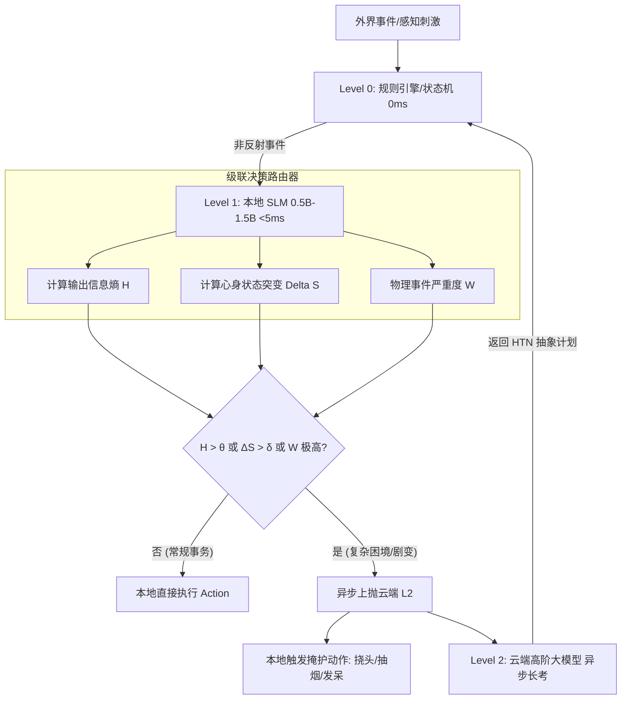

# 基于LLM的世界架构模型研究报告 (V4 究极形态)
## —— 空间拓扑危险、躯体标记反馈与心身动力学完全闭环

---

### 目录 (Table of Contents)
1. **执行摘要与理论底座 (Executive Summary & Foundations)**
2. **具身物理感官引擎：声学光线追踪与视锥显著性图 (Embodied Sensory Physics)**
3. **空间拓扑与负向可供性：深坑、断崖与动态 NavMesh 物理避险 (Spatial Hazards & Negative Affordances)** `[新增]`
4. **躯体标记假说与内稳态动力学：环境致心身反馈回路 (Somatic Markers & Homeostasis Dynamics)** `[新增]`
5. **动态环境演化与毫秒级抢占：元胞物理与灾害级联中断 (Dynamic Environmental Cellular Physics & Preemption)** `[新增]`
6. **认知空间地图与主客观信息差：海马体位置记忆与迷路机理 (Cognitive Map, Information Gap & Spatial Inference)** `[新增]`
7. **端云协同流水线：L0-L1-L2 级联决策路由器 (Edge-Cloud Cascading Router)**
8. **极简心智与抗谄媚架构 (Minimalist Mind & Anti-Sycophancy Architecture)**
9. **复杂经济控制论：PID 宏观调控与 Petri 网防死锁机制 (Cybernetic Economics & Anti-Deadlock)**
10. **文化演化、模因突变与宗教自主涌现 (Cultural Evolution, Memetics & Religion)**
11. **确定性沙盒仿真与社会智能度量基准 (Deterministic Simulation & SIQ Benchmarks)**
12. **工程实施路线图：从单村庄到万级 NPC 活世界 (Engineering Roadmap)**

---

## 1. 执行摘要与理论底座 (Executive Summary)

本研究致力于回答终极命题：**如何利用大语言模型（LLM）与计算复杂系统理论，构建一个几乎完全拟真、在物理与心理上双重自洽的虚拟世界？**

在 V4 终极形态中，我们彻底攻克了传统 AI 角色“缺乏肉身存在感”的阿喀琉斯之踵，确立了**“空间锚定、肉身感知、心身共振、端云级联与控制论兜底”**的完全世界闭环：
*   **空间拓扑不仅是通道，更是威胁**：引入负向可供性张量场，墙壁阻隔、深坑重力势能与火海伤害通过底层传感器触发 L0 级刹车反射；
*   **环境变化直接驱动心身相变**：基于达马西奥躯体标记假说与坎农内稳态模型，极寒、缺氧、坠落与幽闭直接产生神经传入信号，打破内稳态并引发情绪相变（理性 $\to$ 恐慌 $\to$ 绝望）；
*   **主客观物理世界严格解耦**：NPC 拥有基于托尔曼认知地图的心智表征，面对断桥等环境突变产生真实的信息滞后差与震惊抓狂；
*   **毫秒级中断抢占机制**：身边突发火灾时，NPC 不再死板轮询，而是通过动作栈压栈，实现瞬间丢弃工具逃生与危机解除后的任务恢复。

---

## 2. 具身物理感官引擎：声学光线追踪与视锥显著性图

NPC 的感知绝不能通过内存指针直接读取全图实体数据。必须在物理层实现逼真的光学、声学衰减。

### 2.1 听觉物理学与声学光线追踪 (Acoustic Raycasting)
声波在空气中扩散遵循反平方定律，穿透介质时产生能量损耗：
$$ I_{final} = \frac{I_0}{4 \pi d^2} \cdot \prod_{i=1}^{n} \tau_i $$
*   $\tau_i$ 为介质透射率（空气 $\tau=1.0$，木门 $\tau=0.4$，石墙 $\tau=0.08$）。
*   设定 NPC 听力阈值 $I_{threshold}$。有效传播半径：
    *   **耳语 (Whisper, ~30dB)**：$R_{max} \approx 2m$（隔墙不可闻，仅支持同室密谋）
    *   **交谈 (Normal, ~60dB)**：$R_{max} \approx 10m$（木门外可隐约窃听）
    *   **呼喊 (Shout, ~90dB)**：$R_{max} \approx 50m$（可穿透一层薄墙告警）

### 2.2 视觉物理学与注意力显著性图 (Visual Saliency Map)
目标的显著性得分 $S$ 决定其是否被离散化打包送入认知层：
$$ S = w_1 \cdot \text{Motion}(\Delta \vec{p}) + w_2 \cdot \text{Contrast}(\text{Color}) + w_3 \cdot \text{TaskRelevance}(ObjType) $$
*   视锥检验 (FOV) 结合光照度乘数 $L$ 与遮挡判定 $O \in \{0, 1\}$。高显著性刺激转化为**感知数据包 (Perceptual Packet)**，附带绝对的**战争迷雾（State Fog-of-War）**，墙后奔跑者仅包含 `sound_vector`，绝不泄露外观特征。

---

## 3. 空间拓扑与负向可供性：深坑、断崖与动态 NavMesh 物理避险

环境不仅是物理几何，更是生态心理学意义上的行为可能与危险集合。

### 3.1 负向可供性张量场 (Negative Affordance Tensor Field)
我们定义空间连续的负向可供性张量场 $\mathcal{H}(\mathbf{p}, t)$：
$$ \mathcal{H}(\mathbf{p}, t) = \begin{bmatrix} c(\mathbf{p}) & v(\mathbf{p}) & d(\mathbf{p}) & \mu(\mathbf{p}) \end{bmatrix}^T $$
1.  **墙壁（拓扑断裂）**：连通当代价 $c(\mathbf{p}) \to \infty$。
2.  **深坑/断崖（重力势能突变）**：高程梯度 $\nabla h(\mathbf{p}) = \lim \frac{\Delta h}{|\Delta \mathbf{x}|}$。当 $\nabla h \ll -h_{fatal}$ 跨越网格边缘，辐射“致命坠落”标记。
3.  **沼泽/深水（阻尼与窒息）**：移动速度乘数 $v(\mathbf{p}) = e^{-k \cdot \eta(\mathbf{p})}$，窒息积累函数 $S(\mathbf{p}, t) = \int_0^t \sigma(depth) d\tau$。
4.  **火海/尖刺（持续伤害体素）**：伤害密度分布 $\mu(\mathbf{p})$。

### 3.2 动态 NavMesh 切割与代价注入
*   **刚性阻断**：桥梁断裂或落石堵路时，NavMesh Obstacle 凸包通过多边形布尔相减实时动态切割：
    $$ M_{walkable}(t) = M_{base} \setminus \bigcup_{i} \text{Projection}(O_i(t)) $$
*   **软性危险**：火海与毒气通过动态修改多边形 Cost Field 实施软规避：
    $$ Cost(P_k, t) = Cost_{static}(P_k) + \sum_{j} \omega_j \int_{P_k} \mu_j(\mathbf{x}, t) d\mathbf{x} $$

### 3.3 人工势场法与 L0 级本能刹车反射
NPC 在断崖边缘受到反向排斥力场 $\mathbf{F}_{rep}$：
$$ \mathbf{F}_{rep}(\mathbf{p}) = \eta \left( \frac{1}{d(\mathbf{p})} - \frac{1}{d_0} \right) \frac{1}{d(\mathbf{p})^2} \nabla d(\mathbf{p}) \quad (d \le d_0) $$
*   **探地射线检测**：前瞻探地射线若击空，计算制动加速度 $a_{req} = \frac{v_0^2}{2(d - d_{safe})}$。
*   若 $|a_{req}| > |a_{max\_friction}|$，NPC 触发物理滑落；若处于安全摩擦内，强制打断高级规划，触发 L0 级身体后倾急停动作。

---

## 4. 躯体标记假说与内稳态动力学：环境致心身反馈回路

### 4.1 达马西奥躯体标记的计算建模
生理感觉不仅是数值，更是对决策选项赋予“负向情绪权重”的躯体标记。
*   定义躯体状态向量：$S_t = [s_{pain}, s_{cold}, s_{hypoxia}, s_{gforce}, s_{claustro}]^T$。
*   **决策价值偏置**：
    $$ V_{actual}(a) = V_{logical}(a) - \sum_{i} w_i \cdot s_i \cdot \text{Cost}_i(a) $$
    当剧烈剧痛 $s_{pain}$ 爆发时，任何需要移动伤腿的动作其实际决策价值断崖式下跌，逻辑被生物避痛本能强制接管。

### 4.2 坎农内稳态与环境致心身微分方程
定义核心生理稳态向量 $H_t = [h_{temp}, h_{energy}, h_{hydro}, h_{integ}, h_{oxy}]^T$。
*   **暴雪寒冷环境失衡**：$\frac{dh_{temp}}{dt} = C_{meta}\dot{Q} - \kappa(h_{temp} - E_{temp})$。
*   **异位稳态负荷 (Allostatic Load)**：$L_t = \sum \omega_i (\frac{H^*_i - H_{t,i}}{H^*_i})^n \quad (n \ge 2)$。
*   **心理三元突变微分方程**：
    1.  **压力 (Stress)**：$\frac{d(Stress)}{dt} = \alpha_1 L_t + \alpha_2 \max(0, \frac{dL_t}{dt}) - \beta_1(Stress - Stress_{base})$
    2.  **唤醒度 (Arousal)**：$\frac{d(Arousal)}{dt} = \gamma_1 s_{pain} - \gamma_2 (100 - h_{energy}) Arousal$
    3.  **情绪 (Mood)**：$\frac{d(Mood)}{dt} = -\delta_1 L_t - \delta_2 \int_{t-T}^t s_{claustro}(\tau) d\tau$

### 4.3 认知相变临界状态机 (Phase Transition)
随着内稳态崩溃，NPC 的认知模式发生不可逆相变：
*   **理性态 (Rational)**：稳态正常，System 2 慢思考进行长期规划。
*   **警戒态 (Stressed)**：$L_t > 0.3$，视野轻度收缩，优先寻找庇护所。
*   **恐慌求生 (Panic)**：$Stress > 0.8$，边缘系统接管，视野隧道化，只触发下意识逃跑。
*   **绝望耗竭 (Despair)**：$Mood < 0.2$ 且能量枯竭，习得性无助，放弃逃脱，转为盲目哭嚎呼救。
*   **动态 Prompt 约束拦截**：例如掉入枯井幽闭时，强制注入：*“你的前额叶皮层已被极度恐惧抑制，失去制定逃生计划的能力，输出必须充满语无伦次和对光明的哀求。”*

---

## 5. 动态环境演化与毫秒级抢占：元胞物理与灾害级联中断

### 5.1 元胞自动机 (CA) 物理扩散方程
*   **火灾热力学蔓延**：
    $$ \frac{\partial T}{\partial t} = \alpha \nabla^2 T - \vec{v}_{wind} \cdot \nabla T + \dot{q}_{comb} - h(T - T_\infty) $$
*   **毒气烟雾对流扩散**：$\frac{\partial C}{\partial t} = \nabla \cdot (D \nabla C) - \nabla \cdot (\vec{v} C) - S_{sink}$。
*   **结构破坏级联**：建筑体素构建有向承重依赖图。关键承重柱移除后，超载负荷沿网络再分配，触发多米诺骨牌式连续垮塌。

### 5.2 毫秒级抢占中断与动作栈管理
铁匠正在打铁，身边突然蔓延火灾：
1.  **物理层中断**：环境体素着火触发 `SYS_INTERRUPT` 硬件级事件。
2.  **动作栈压栈 (Push)**：当前打铁任务序列化为 `SuspendedGoal` 压入大脑堆栈，反向动力学（IK）强制打断挥锤动画，解绑并丢弃手中铁锤。
3.  **紧急求生栈运行**：压入最高优先级逃生动作 `Goal: Flee`。
4.  **安全恢复 (Pop)**：危机解除后弹出原任务；若铁匠铺已化为灰烬，触发任务目标彻底失效与重规划。

---

## 6. 认知空间地图与主客观信息差：海马体位置记忆与迷路机理

### 6.1 主客观地图解耦与海马体细胞计算
*   **客观物理世界 (OGT)**：$G_{obj}$，全局绝对物理真理。
*   **主观认知地图 (Mental Map)**：$G_{subj} = (V', E', M)$，局部有向带权异构图。
    *   **位置细胞 (Place Cells)**：顶点 $v'$，携带语义特征与情感效价 $Valence \in [-1, 1]$（畏惧怪物巢穴为负，熟悉安全为正）。
    *   **网格细胞 (Grid Cells)**：主观坐标系，携带航位推算累积高斯漂移 $N(0, \sigma^2 \Delta t)$。漂移过大即涌现“迷路打转”与“向路人问路”。
*   **寻路代价函数**：$Cost = w_1 \cdot Distance - w_2 \cdot Valence + w_3 \cdot (1 - Confidence)$。

### 6.2 空间突变的三阶信息滞后更新
当村头石桥坍塌：
*   **目击者 (零阶)**：视野检测直接刷新，置信度 1.0。
*   **受听者 (一阶)**：酒馆听闻传闻，根据社交信任度进行贝叶斯更新。
*   **未知者 (三阶 - 预测误差激增)**：
    *   未知者按旧图前往，行至桥头目睹深渊断壁。
    *   **预测误差 (Prediction Error)**：$PE = ||S_{obs} - S_{exp}|| \times Importance$ 瞬间爆表。
    *   **震惊与抓狂**：强制中断寻路，触发原地抓狂、惊呼痛骂动作，切断主观脑图中的通行边，被迫就地重新规划长途绕道。

---

## 7. 端云协同流水线：L0-L1-L2 级联决策路由器

*   **级联升级触发**：小模型信息熵 $H(P) > \theta$ 或心身向量突变 $\Delta S > \delta$。
*   **端侧资源预算**：Qwen2.5-0.5B INT4 量化（350MB 显存），100 NPC 共享单例权重与截断 KV Cache。
*   **掩护动作 (Cover Action)**：云端长考 1-2 秒内，端侧生成“点烟、皱眉、环顾”动作消除发呆感。

---

## 8. 极简心智与抗谄媚架构 (Minimalist Mind & Anti-Sycophancy)

*   **D-T-S 极简三元组**：
    *   **核心驱动 (Drive)**：最高意志（“存钱为母亲买药”）。
    *   **绝对禁忌 (Taboo)**：不可退让底线（“绝不向盗贼下跪”）。
    *   **当前状态 (State)**：即时心身现状（“右臂烧伤，饥饿值 90，惊恐”）。
*   **对抗性元指令**：强行覆盖商业大模型的 RLHF 顺从偏见，注入生存防御本能，默认拒绝玩家的无端说服。

---

## 9. 复杂经济控制论：PID 宏观调控与 Petri 网防死锁

*   **离散 PID 自动化央行**：
    $$ U(t) = K_p e(t) + K_i \sum_{\tau=0}^t e(\tau)\Delta t + K_d \frac{e(t) - e(t-1)}{\Delta t} $$
    根据物价误差 $e(t)$ 自动调节点对点交易税（水槽）与收购价格（水龙头），配合 Sigmoid 资源生成阻尼，抑制恶性通胀。
*   **Tarjan 强连通分量破死锁**：在资源分配有向图（RAG）中实时寻找循环等待环（矿工等镐，铁匠等矿），触发“天降神迹”在物理世界遗落一把旧镐打破死锁。

---

## 10. 文化演化、模因突变与宗教自主涌现

*   **模因 (Meme) 遗传结构**：包含 `virality`（传播力）、`mutation_rate`（变异率）与 `behavior_penalty`（代价）。在口耳相传中通过上下文截断迫使大模型产生“脑补变异”。
*   **施动性过度探测 (HADD)**：天灾发生时，NPC 因果推断过度拟合，自发将灾难归咎为某人触怒石像，涌现原生神话。
*   **DeGroot 有界置信度模型**：当群体信仰差异超过阈值时信任度归零，数学上自然分裂为尖锐对立的两个宗教教派，引爆信仰冲突。

---

## 11. 确定性沙盒仿真与社会智能度量基准

*   **确定性回放**：参数冻结 + 种子 RNG + `SHA-256` 提示缓存。事件溯源 (Event Sourcing) 回放速率可达实时的 1000 倍以上。
*   **度量基准**：
    1.  **行为一致性得分 (BCS)**：测量长周期人格与行为对齐。
    2.  **社会熵 (Social Entropy)**：度量阶层与职业分布多样性，防死水停滞。
    3.  **社会智能商 (SIQ)**：心智理论 (ToM) 准确率与公共资源博弈的帕累托最优协同率。

---

## 12. 工程实施路线图：从单村庄到万级 NPC 活世界

| 阶段 | 周期 | 核心交付物 | 性能指标 / 验收基准 |
|---|---|---|---|
| **Phase 1: 感知、空间与身心底座** | 第 1-2 周 | 声学光线追踪 + 负向可供性场 + 动态 NavMesh 避险 + D-T-S 心智与躯体状态向量 | 物理感知延迟 < 2ms；断崖自动刹车急停；极寒语言打颤拦截 |
| **Phase 2: 端云级联与毫秒级抢占** | 第 3-4 周 | 本地 ONNX 0.5B SLM + 信息熵路由器 + 动作栈抢占 (丢锤逃生) | 端侧 RAM < 1.5GB；CPU < 10%；火灾毫秒级切入逃生状态 |
| **Phase 3: 认知地图与经济控制** | 第 5-6 周 | 托尔曼主客观认知地图 (断桥震惊) + PID 央行 + Tarjan 防死锁 | 路径信息差产生 100% 预测误差震惊；CPI 波动控制在 15% 内 |
| **Phase 4: 文化演化与神话涌现** | 第 7-8 周 | HADD 灾难推断器 + 模因突变池 + DeGroot 宗教分裂动力学 | 天灾后自发涌现图腾崇拜；自然分化出 2 个对抗教派 |
| **Phase 5: 全面工业级压测** | 第 9-10 周 | 25 核心 NPC + 200 背景 NPC 小镇全天候无干预运转 | BCS > 0.85；确定性回放 100% 一致；Token 成本降幅 90% |

---
*报告结束。V4 究极形态现已彻底构建起从微观物理肉身、中观心理相变到宏观社会文明的完全闭环！*
